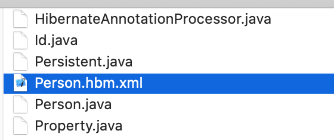

# Annotation

Annotation注解是代码里的特殊标记, 这些标记可以在编译、类加载、 运行时被读取, 并执行相应的处理. 通过使用注解, 开发人员可以在不改变原有逻辑的情况下, 在源文件中嵌入一些补充信息.

Annotation不影响程序代码的运行, 如果希望让程序中的Annotation在运行时起一定的作用, 需要通过某种配套工具对Annotation中的信息进行访问和处理, 访问和处理Annotion的工具统称APT(Annotation Processing Tool).

Java在位于java.lang包下提供了5个基本的Annotation:
- @Override: 标记覆盖父类方法
- @Depecated: 标记某个类,接口或方法已过时
- @SuppressWarnings: 抑制编译器警告
- @SafeVarargs // java7新增
- @FunctionalInterface // java8新增

**@SuppressWarnings**

@SuppressWarnings指示被该Annotation修饰的程序元素(以及访程序元素的所有子元素)取消显示指定的编译器警告. @SuppressWarnings会一直作用于该程序元素的所有子元素.

```java
@SuppressWarnings(value = "unchecked")
public class SuppressWarningTest {
    public static void main(String[] args) {
        List<String> myList = new ArrayList();
        myList.add("hello");
    }
}
```

**@FunctionalInterface**

Java8引入的函数式接口, 如果接口中只有一个抽象方法, 该接口就是函数式接口.  
注: 函数式接口的抽象方法针对的是对象, 因此函数式接口可以包含多个默认方法或多个static方法

```java
@FunctionalInterface
public interface FunInterface {
    static void foo() {}
    default void bar() {}
    void test(); // 只定义一个抽象方法
}
```

### 元Annotation

元Annotation, 即Meta Annotation, 是用于修饰Annotation的Annotation, 位于java.lang.annotation包下

**@Retention**

@Retention只能用于修饰Annotation定义, 指定被修饰的Annotation可以保留多长时间.

- RetentionPolicy.CLASS: 默认值; 编译器把Annotation记录在class文件中, 当运行Java程序时, JVM不可获取Annotation信息
- RetentionPolicy.RUNTIME: 编译器把Annotation记录在class文件中, 当运行Java程序时, JVM可以通过反射获取Annotation信息
- RetentionPolicy.SOURCE: Annotation只保留在源码中, 编译器直接丢弃这种Annotation

```java
@Retention(value = RetentionPolicy.RUNTIME)
public @interface Testable {
    // ...
}

// 当成员变量名为value时, 可以直接指定该成员变量的值
// 无须使用value=Xxx中的value
@Retention(RetentionPolicy.SOURCE)
public @interface Testable {
    // ...
}
```

**@Target**

@Target也只能修饰Annotation定义, 指定被修饰的Annotation能用于修饰哪些程序单元.

```java
public enum ElementType {
    /** Class, interface (including annotation type), or enum declaration */
    TYPE,
    /** Field declaration (includes enum constants) */
    FIELD,
    /** Method declaration */
    METHOD,
    /** Formal parameter declaration */
    PARAMETER,
    /** Constructor declaration */
    CONSTRUCTOR,
    /** Local variable declaration */
    LOCAL_VARIABLE,
    /** Annotation type declaration */
    ANNOTATION_TYPE,
    /** Package declaration */
    PACKAGE,
    /**
     * Type parameter declaration
     *
     * @since 1.8
     */
    TYPE_PARAMETER,
    /**
     * Use of a type
     *
     * @since 1.8
     */
    TYPE_USE
}

@Target(ElementType.FIELD)
public @interface ActionListenerFor {}
```

**@Documented**

指定被该元Annotation修饰的Annotation将被javadoc工具提取文档.

**@Inherited**

@Inherited元Annotation指定被它修饰的Annotation将具有继承性 -- 如果某个类使用了@Xxx注解(定义该Xxx Annotation时使用了@Inherited)修饰, 则其子类将自动被@Xxx修饰.

```java
@Target(ElementType.Type)
@Retention(RetentionPolicy.RUNTIME)
@Inherited
public @interface MyInherite {
}

@MyInherite
class Base {}

// Sub虽然没有显示指定@MyInherite
// 但由于继承于Base, Base使用了@MyInherite, 因此Sub通过继承也使用了@MyInherite
public class Sub extends Base {
    public static void main(String[] args) {
        System.out.println(Sub.class.isAnnotationPresent(MyInherite.class)); // true
    }
}
```

### 自定义Annotation

自定义Annotation, 使用@interface关键字(在interface前加@)

```java
// 这个注解接口默认继承了Annotation接口
// 默认情况下, Annotation可用于修饰任何程序元素
public @interface MyTag {
    // 定义带两个成员变量的Annotation
    // Annotation中的成员变量以方法的形式来定义
    String name();
    int age();
}
```

使用:  

```java
public class Test {
    // 由于MyTag定义有成员变量, 而且没有默认值
    // 使用MyTag注解时必须要为成员变量赋值
    @MyTag(name = "daliu", age = 30)
    public void into() {
        // ...
    }
}
```

也可以在定义Annotation的成员变量时为其指定初始默认值

```java
public @interface MyTag {
    String name() default "daliu";
    int age() default 30;
}
```

没有定义成员变量的Annotation类型被称为标记Annotation, 包含成员变量的Annotation被称为元数据Annotation.

### 提取Annotation信息

提取Annotation信息需要用到反射, Java 5在java.lang.reflect包中增加了读取运行时Annotation的能力. 只有当定义Annotation时使用了@Retention(RententionPolicy.RUNTIME)修饰, 该Annotation才会在运行时可见, JVM才会在装载*.clas文件时读取保存在class文件中的Annotation.

AnnotatedElement接口是 Class、 Method、 Constructor等接口的父接口, 程序可以通过反射获取Class, Method, Constructor, 调用AnnotatedElement接口的方法访问Annotation的信息

- <A extends Annotation>A getAnnotation(Class<A> annotationClass): 返回该程序元素上存在的, 指定类型的注解, 若不存在, 返回null
- <A extends Annotation>A getDeclaredAnnotation(Class<A> annotationClass): Java 8新增, 获取直接修饰该程序元素, 指定类型的Annotation, 若不存在, 返回null
- Annotation[] getAnnotations(): 返回该程序元素上存在的所有Annotation
- Annotation[] getDeclaredAnnotations(): 返回直接修饰该程序元素的所有Annotation
- boolean isAnnotationPresent(Class<? extends Annotation> annotationClass): 判断该程序元素上是否存在指定类型的注解, 存在返回true,不存在返回false
- <A extends Annotation> A[] getAnnotationsByType(Class<A> annotationClass): 由于Java 8增加了重复注解功能, 因此有时候需要借助此方法获取修饰该程序元素,指定类型的多个Annotation
- <A extends Annotation> A[] getDeclaredAnnotationsByType(Class<A> annotationClass): 由于Java 8增加了重复注解功能, 因此有时候需要借助此方法获取直接修饰该程序元素,指定类型的多个Annotation

示例:

```java
// -- MyTag.java --
import java.lang.annotation.Retention;
import java.lang.annotation.RetentionPolicy;

@Retention(RetentionPolicy.RUNTIME)
public @interface MyTag {
    String name() default "daliu";
    int age() default 30;
}

// -- Test.java --
public class Test {
    // 由于MyTag定义有成员变量, 而且没有默认值
    // 使用MyTag注解时必须要为成员变量赋值
    @MyTag(name = "daliu", age = 30)
    public void info() {
    }
}

// -- Main.java --
import java.lang.annotation.Annotation;

public class Main {
    public static void main(String[] args) throws ClassNotFoundException, NoSuchMethodException {
        Test test = new Test();
        Annotation[] annotations = test.getClass().getMethod("info").getAnnotations();
        // 上面2句相当于下面1句:
        // Annotation[] annotations = Class.forName("Test").getMethod("info").getAnnotations();
        System.out.println(annotations);
        System.out.println(annotations.length);
        for (Annotation an : annotations) {
            System.out.println(an);
        }
    }
}
```

### 使用Annotation的示例Testable

JUnit测试框架要求测试方法以test开头, 我们可以通过自定义@Testable注解把任何方法标记为可测试的

```java
// -- Testable.java --
import java.lang.annotation.ElementType;
import java.lang.annotation.Retention;
import java.lang.annotation.RetentionPolicy;
import java.lang.annotation.Target;

/**
 * 标记注解
 */
@Retention(RetentionPolicy.RUNTIME)
@Target(ElementType.METHOD)
public @interface Testable {
}
```

```java
// -- MyTest.java --
public class MyTest {
    // 使用@Testable注解指定的方法是可测试的
    // 把m1, 3, 5, 7标记为可测试的
    @Testable
    public static void m1() {}
    public static void m2() {}
    @Testable
    public static void m3() {}
    public static void m4() {}
    @Testable
    public static void m5() {}
    public static void m6() {}
    @Testable
    public static void m7() {
        throw new RuntimeException("程序业务出现异常!");
    }
    public static void m8() {}
}
```

```java
// -- ProcessorTest.java --
import java.lang.reflect.Method;

public class ProcessorTest {
    public static void process(String clazz) throws ClassNotFoundException {
        int passed = 0;
        int failed = 0;
        for (Method m : Class.forName(clazz).getMethods()) {
            // 如果该方法使用了@Testable修饰
            if (m.isAnnotationPresent(Testable.class)) {
                try {
                    // 调用m方法
                    m.invoke(null);
                    passed++;
                    System.out.println("方法" + m.getName() + " 测试成功");
                } catch (Exception ex) {
                    System.out.println("方法" + m.getName() + "测试失败: " + m + " reason: " + ex.getCause());
                    failed++;
                }
            }
        }
        System.out.println("共执行了" + (passed+failed) + "个方法, 其中失败: " + failed + "个, 成功: " + passed + "个");
    }

    public static void main(String[] args) throws Exception {
        ProcessorTest.process("MyTest");
        /**
         * 程序打印:
         方法m1 测试成功
         方法m3 测试成功
         方法m5 测试成功
         方法m7测试失败: public static void MyTest.m7() reason: java.lang.RuntimeException: 程序业务出现异常!
         共执行了4个方法, 其中失败: 1个, 成功: 3个
         */
    }
}
```

### 使用Annotation的示例ActionListener

在传统的事件编程中总是需要通过`addActionListener()`方法为事件源绑定事件监听器, 本示例程序中通过`@ActionListenerFor`注解为程序中的按钮绑定事件监听器

```java
// -- ActionListenerFor.java --
import java.awt.event.ActionListener;
import java.lang.annotation.ElementType;
import java.lang.annotation.Retention;
import java.lang.annotation.RetentionPolicy;
import java.lang.annotation.Target;

@Target(ElementType.FIELD)
@Retention(RetentionPolicy.RUNTIME)
public @interface ActionListenerFor {
    Class<? extends ActionListener> listener();
}
```

```java
// -- Annotation处理 --
// -- ActionListenerInstaller.java --
import javax.swing.*;
import java.awt.event.ActionListener;
import java.lang.reflect.Field;

public class ActionListenerInstaller {
    // 处理Annotation的方法, 其中obj是包含Annotation的对象
    public static void processAnnotations(Object obj) {
        try {
            // 获取obj对象的类
            Class c1 = obj.getClass();
            // 获取指定obj对象的所有成员变量, 并遍历每个成员变量
            for (Field field : c1.getDeclaredFields()) {
                // 将成员变量设置成可自由访问
                field.setAccessible(true);
                // 获取该成员变量上ActionListenerFor类型的Annotation
                ActionListenerFor a = field.getAnnotation(ActionListenerFor.class);
                // 获取成员变量field的值, 比如JButton
                Object fObj = field.get(obj);
                // 如果成员变量不为空, 并且有ActionListenerFor注解
                if (a != null && fObj != null && fObj instanceof AbstractButton) {
                    // 获取a注解的listener元数据(它是一个监听器)
                    Class<? extends ActionListener> listenerClazz = a.listener();
                    // 使用反射来创建listener类的对象
                    ActionListener listener = listenerClazz.newInstance();
                    AbstractButton button = (AbstractButton)fObj;
                    button.addActionListener(listener);
                }
            }
        } catch (Exception ex) {
            ex.printStackTrace();
        }
    }
}
```

```java
// -- AnnotationTest.java --
import javax.swing.*;
import java.awt.event.ActionEvent;
import java.awt.event.ActionListener;

class OkListener implements ActionListener {
    @Override
    public void actionPerformed(ActionEvent e) {
        JOptionPane.showMessageDialog(null, "单击了确认按钮");
    }
}

class CancelListener implements ActionListener {
    @Override
    public void actionPerformed(ActionEvent e) {
        JOptionPane.showMessageDialog(null, "单击了取消按钮");
    }
}

public class AnnotationTest {
    private JFrame mainWin = new JFrame("使用注解绑定事件监听器");
    @ActionListenerFor(listener = OkListener.class)
    private JButton okButton = new JButton("确定");
    @ActionListenerFor(listener = CancelListener.class)
    private JButton cancelButton = new JButton("取消");

    public void init() {
        JPanel panel = new JPanel();
        panel.add(okButton);
        panel.add(cancelButton);
        mainWin.add(panel);
        ActionListenerInstaller.processAnnotations(this);
        mainWin.setDefaultCloseOperation(JFrame.EXIT_ON_CLOSE);
        mainWin.pack();
        mainWin.setVisible(true);
    }

    public static void main(String[] args) {
        new AnnotationTest().init();
    }
}
```

### 类型注解

Java 8为ElementType枚举新增了TYPE_PARAMETER(Type parameter declaration)和TYPE_USE(Use of a type)，这种注解被称为类型注解(Type Annotation)，类型注解可用于修饰任何地方出现的类型。

```java
import javax.swing.*;
import java.io.Serializable;
import java.util.List;

@NotNull
// 定义类时使用类型对解
public class TypeAnnotationTest implements Serializable {
    // 方法形参中使用类型注解
    public static void main(@NotNull String[] args) {
        Object obj = "hello world";
        // 强制类型转换时类型注解
        String s = (@NotNull String)obj;
        // 创建对象时使用类型注解
        Object win = new JFrame("Hello");
    }
    // 泛型中使用类型注解
    public void foo(List<@NotNull String> info) {}
}
```

### 重复注解

Java 8以前，如果需要在同一个元素前使用多个相同类型的注解，必须使用“容器”:

```java
@Results
( 
    {
        @Result(name="failure", location="failure.jsp"),
        @Result(name="success", location="success.jsp")
    }
)
public Action FooAction {
    // ... 
}
```

在Java 8之后，开发重复注解可以使用@Repeatable修饰，从而简化容器注解的写法。  
开发重复注解示例：

```java
// -- MyTag.java --
import java.lang.annotation.*;

@Retention(RetentionPolicy.RUNTIME)
@Target(ElementType.TYPE)
@Repeatable(MyTags.class) // 即指定容器注解是MyTags
public @interface MyTag {
    String name() default "Bruse Lee";
    int age();
}
```

```java
// -- MyTags.java --
import java.lang.annotation.ElementType;
import java.lang.annotation.Retention;
import java.lang.annotation.RetentionPolicy;
import java.lang.annotation.Target;

// 这个注解是@MyTag注解的容器注解
// 容器注解的保留期retention必须>=它包含的注解
// 容器注解需要实现一个叫value的成员变量并返回要包含注解的数组
@Retention(RetentionPolicy.RUNTIME)
@Target(ElementType.TYPE)
public @interface MyTags {
    // 定义value成员变量，该成员变量可接受多个@MyTag注解
    MyTag[] value();
}
```

```java
// -- MyTagTest.java --
@MyTag(age = 5)
@MyTag(name = "大刘", age = 30)
public class MyTagTest {
    public static void main(String[] args) {
        Class<MyTagTest> clazz = MyTagTest.class;
        // 使用Java8接口获取MyTagTest类的多个@MyTag注解
        MyTag[] tags = clazz.getDeclaredAnnotationsByType(MyTag.class);
        for (MyTag tag : tags) {
            System.out.println(tag.name() + "-->" + tag.age());
        }
        // 使用传统方法获取
        MyTags containerTags = clazz.getDeclaredAnnotation(MyTags.class);
        System.out.println(containerTags);
    }
}
/** Print:
 * Bruse Lee-->5
 * 大刘-->30
 * @MyTags(value=[@MyTag(name=Bruse Lee, age=5), @MyTag(name=大刘, age=30)])
 */
```

重复注解只是一种简化写法，这种简化写法是一种假象：多个重复注解其实会被作为“容器”注解的value成员变量的数组元素。

### 编译时处理注解

APT: Annotation Processing Tool 是一种注解处理工具

```java
java -processor APT ...
```

每个注解处理器都需要实现javax.annotation.processing包下的Processor接口，不过一般采用继承AbstractProcessor的方式实现注解处理器。  
下面创建一个APT，仿照Hibernate处理注解，根据注解生成XML文件。



```java
// -- Persistent.java --
import java.lang.annotation.*;

@Target(ElementType.TYPE)
@Retention(RetentionPolicy.SOURCE) // SOURCE: Annotations are to be discarded by the compiler.
@Documented
public @interface Persistent {
    String table();
}
```

```java
// -- Id.java --
import java.lang.annotation.*;

@Target(ElementType.FIELD)
@Retention(RetentionPolicy.SOURCE)
@Documented
public @interface Id {
    String column();
    String type();
    String generator();
}
```

```java
// -- Property.java --
import java.lang.annotation.*;

@Target(ElementType.FIELD)
@Retention(RetentionPolicy.SOURCE)
@Documented
public @interface Property {
    String column();
    String type();
}
```

```java
// -- Person.java --
@Persistent(table = "person_inf")
public class Person {
    @Id(column = "id", type = "integer", generator = "identity")
    private int id;
    @Property(column = "name", type = "string")
    private String name;
    @Property(column = "age", type="integer")
    private int age;
    public int getId() {
        return id;
    }
    public void setId(int id) {
        this.id = id;
    }
    public String getName() {
        return name;
    }
    public void setName(String name) {
        this.name = name;
    }
    public int getAge() {
        return age;
    }
    public void setAge(int age) {
        this.age = age;
    }
}
```

```java
// -- HibernateAnnotationProcessor.java --

import javax.annotation.processing.*;
import javax.lang.model.SourceVersion;
import javax.lang.model.element.Element;
import javax.lang.model.element.ElementKind;
import javax.lang.model.element.Name;
import javax.lang.model.element.TypeElement;
import java.io.FileOutputStream;
import java.io.PrintStream;
import java.util.Set;

@SupportedSourceVersion(SourceVersion.RELEASE_8)
@SupportedAnnotationTypes({"Persistent", "id", "Property"})
public class HibernateAnnotationProcessor extends AbstractProcessor {
    @Override
    // 循环处理每个需要处理的程序对象
    public boolean process(Set<? extends TypeElement> annotations, RoundEnvironment roundEnv) {
        // 定义一个文件输出流，用于生成额外的文件
        PrintStream ps = null;
        try {
            System.out.println("start ---------- ");
            // 遍历每个被@Persistent修饰的class文件
            // element就是Person
            for (Element element : roundEnv.getElementsAnnotatedWith(Persistent.class)) {
                // 获取正在处理的类名
                Name clazzName = element.getSimpleName();
                // 获取类定义前的@Persistence注解
                Persistent persistent = element.getAnnotation(Persistent.class);
                // 创建文件输出流
                // ps = new PrintStream(new FileOutputStream("/Users/banma-1118/Desktop/ForDelete/" + clazzName + ".hbm.xml"));
                // ps = new PrintStream(new FileOutputStream("/Users/banma-1118/Desktop/ForDelete/Hello.txt"));
                ps = new PrintStream(new FileOutputStream(clazzName + ".hbm.xml"));
                ps.println("<?xml version=\"1.0\"?>");
                ps.println("<!DOCTYPE hibernate-mapping PUBLIC\n" +
                        "\t\"-//Hibernate/Hibernate Mapping DTD 3.0//EN\"\n" +
                        "\t\"http://www.hibernate.org/dtd/hibernate-mapping-3.0.dtd\">");
                ps.println("<hibernate-mapping>");
                ps.print("\t<class name=\"" + element + "\"");
                ps.print(" table=\"" + persistent.table() + "\">");
                ps.println();
                for (Element f : element.getEnclosedElements()) {
                    // 只处理成员变量上的Annotation
                    if (f.getKind() == ElementKind.FIELD) {
                        // 获取成员变量定义前的@Id Annotation
                        Id id = f.getAnnotation(Id.class);
                        if (id != null) {
                            ps.println("        <id name=\"" + f.getSimpleName() + "\""
                                + " column=\"" + id.column() + "\""
                                + " type=\"" + id.type() + "\">");
                            ps.println("\t\t\t<generator class=\"" + id.generator() + "\"/>");
                            ps.println("        </id>");
                        }
                        // 获取成员变量定义前的@Property Annotation
                        Property p = f.getAnnotation(Property.class);
                        if (p != null) {
                            ps.println("        <property name=\"" + f.getSimpleName()
                                + "\" column=\"" + p.column()
                                + "\" type=\"" + p.type()
                                + "\"/>");
                        }
                    }
                }
                ps.println("    </class>");
                ps.println("</hibernate-mapping>");
            }
        } catch (Exception ex) {
            ex.printStackTrace();
        } finally {
            if (ps != null) {
                try {
                    ps.close();
                } catch (Exception ex) {
                    ex.printStackTrace();
                }
            }
        }
        return false;
    }
}
```

调用命令生成xml文件：  

```shell
$ cd path_to_source_files
$ javac *.java
$ javac -processor HibernateAnnotationProcessor Person.java
```

TODO:// 上面假设所有的源文件全在同一目录下，没有命名空间，但假如文件结构如下：

- com
  - anno
    - Id.java
    - Persistent.java
    - Property.java
  - java
    - Person.java
    - HibernateAnnotationProcessor.java

不清楚如何调用javac命令。