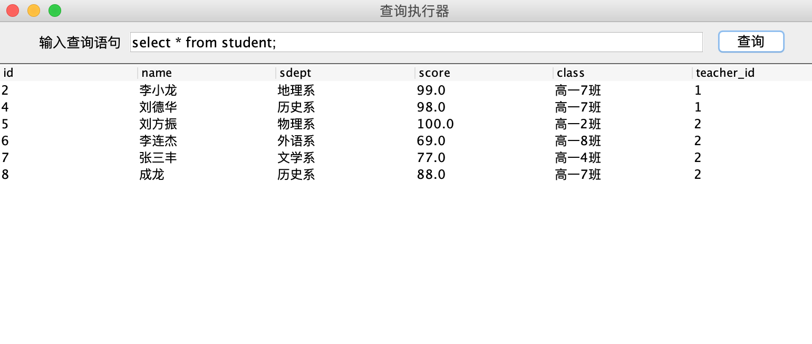

# ResultMetaData

使用ResultMetaData可以分析结果集, meta data是对数据的描述，通常说元数据，ResultSetMetaData包含有对ResultSetData的数据描述，DatabaseMetaData包含有对Database的描述  
常用ResultSetMetaData的三个方法：  
- int getColumnCount()
- String getColumnName(int column)
- int getColumnType(int column)

下面实现一个简单的查询显示：



```java
import javax.swing.*;
import java.awt.*;
import java.awt.event.ActionEvent;
import java.awt.event.ActionListener;
import java.sql.*;
import java.util.Vector;

public class QueryExecutor {
    private static Connection conn;
    private static Statement stmt;
    private JScrollPane scrollPane;
    JFrame frame = new JFrame("查询执行器");
    private JTextField sqlField = new JTextField(45);
    private JButton runBtn = new JButton("查询");

    static {
        try {
            Class.forName(MySQLInfo.driver);
            conn = DriverManager.getConnection(MySQLInfo.url, MySQLInfo.user, MySQLInfo.pass);
            stmt = conn.createStatement();
        } catch (Exception e) {
            e.printStackTrace();
        }
    }

    public void initUI() {
        JPanel top = new JPanel();
        top.add(new JLabel("输入查询语句"));
        top.add(sqlField);
        top.add(runBtn);
        runBtn.addActionListener(new RunListener());
        sqlField.addActionListener(new RunListener()); // 按回车键里触发方法
        frame.add(top, BorderLayout.NORTH);
        frame.setSize(680, 480);
        frame.setDefaultCloseOperation(JFrame.EXIT_ON_CLOSE);
        frame.setVisible(true);
    }

    public void init() {
        this.initUI();
    }

    public static void main(String[] args) {
        new QueryExecutor().init();
    }

    class RunListener implements ActionListener {
        @Override
        public void actionPerformed(ActionEvent e) {
            // 删除原来的JTable(JTable使用scrollPane来包装)
            if (QueryExecutor.this.scrollPane != null) { // 也可直接写成scrollPane
                frame.remove(scrollPane);
            }
            try (ResultSet rs = stmt.executeQuery(sqlField.getText())) {
                // 取出ResultSet的MetaData
                ResultSetMetaData metaData = rs.getMetaData();
                Vector<String> columnNames = new Vector<>();
                Vector<Vector<String>> data = new Vector<>();
                for (int i = 0; i < metaData.getColumnCount(); i++) {
                    columnNames.add(metaData.getColumnName(i+1)); // 索引从1开始
                }
                while (rs.next()) {
                    // 每一行对应一个Vector对象
                    Vector<String> v = new Vector<>();
                    for (int i = 0; i < metaData.getColumnCount(); i++) {
                        v.add(rs.getString(i+1));
                    }
                    data.add(v);
                }
                JTable table = new JTable(data, columnNames);
                scrollPane = new JScrollPane(table);
                frame.add(scrollPane);
                frame.validate();
            } catch (Exception ex) {
                ex.printStackTrace();
            }
        }
    }
}
```