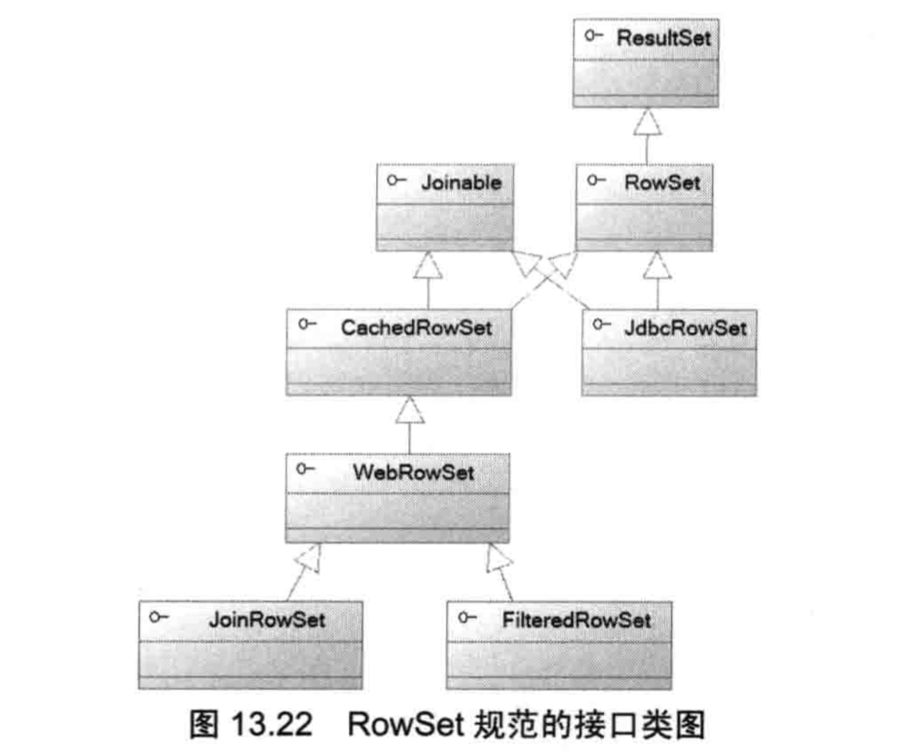

# RowSet




当年C#提供了DataSet, 它可以把底层的数据读取到内存中进行离线操作，操作完成后再同步到底层数据源，Java则提供了与此功能类似的RowSet.
与ResultSet相比，RowSet默认是可滚动、可更新、可序列化的结果集, RowSet的子接口如下：

- JdbcRowSet: 保持连接的RowSet，它和一个具有ResultSet.TYPE_SCROLL_INSENSITIVE 和 ResultSet.CONCUR_UPDATABLE的ResultSet功能相当
- CachedRowSet: 断开连接的RowSet，以缓存的方式实现离线的数据集操作
- FilteredRowSet: 可通过过滤条件得到数据集的子集的RowSet，继承自WebRowSet。Predicate是过滤器接口
- JoinRowSet: 对数据集进行Join连接查询得到的RowSet，继承自WebRowSet。 它和SQL语句的join操作效果类似
- WebRowSet: 可与XML互相转换的RowSet，继承自CachedRowSet。有点类似ORM的意思，不同的是它为XML和Relation Data之间提供映射。

除了JdbcRowSet需要保持与数据库的连接之外，其余4个子接口都是离线的RowSet，无须保持与数据库的连接。  
对于离线RowSet而言，程序在创建RowSet时已把数据从底层数据库读取到了内存，因为可以充分利用计算机的内存，从而降低数据库服务器的负载，提高程序性能。

对于以上接口，Java6.0提供了实现类： 

- JdbcRowSetImpl
- CachedRowSetImpl
- WebRowSetImpl
- FilteredRowSetImpl
- JoinRowSetImpl

以JdbcRowSet为例，构造器：

- JdbcRowSetImp()
- JdbcRowSetImpl(Connection conn) // 如果传入了Connection，就不必填写url, user, password等
- JdbcRowSetImpl(ResultSet rs)

常用方法：

- setUrl(String url)
- setUsername(String name)
- setPassword(String password)
- setCommand(String sql): 设置sql语句
- execute(): 执行查询
- populate(ResultSet rs): 使用ResultSet填充RowSet

由上可知，填充JdbcRowSet数据有两种方式：

- JdbcRowSetImpl(ResultSet rs) 通过构造器传入ResultSet
- populate(ResultSet rs): 使用ResultSet填充RowSet

JdbcRowSetImpl方法，[官网](https://docs.oracle.com/cd/E17824_01/dsc_docs/docs/jscreator/apis/rowset/com/sun/rowset/JdbcRowSetImpl.html)

使用JdbcRowSetImpl示例：

```xml
<!-- pom.xml -->
<dependencies>
    <dependency>
        <groupId>mysql</groupId>
        <artifactId>mysql-connector-java</artifactId>
        <version>5.1.47</version> <!--使用8.x的驱动出现问题，驱动bug-->
    </dependency>
</dependencies>
```

```java
// -- MySqlInfo.java --
public class MySQLInfo {
    // public static String driver ="com.mysql.cj.jdbc.Driver"; // 使用8.x版本驱动
    public static String driver ="com.mysql.jdbc.Driver"; // 使用老版本驱动，比如5.1.47
    public static String url = "jdbc:mysql://127.0.0.1:3306/daliu?characterEncoding=utf-8&useSSL=false";
    public static String user = "root";
    public static String pass = "daliu8807";
}
```

```java
// -- JdbcRowSetTest.java --
import com.sun.rowset.JdbcRowSetImpl;

import javax.sql.rowset.JdbcRowSet;
import java.sql.Connection;
import java.sql.DriverManager;

public class JdbcRowSetTest {
    public void update(String sql) throws Exception {
        Class.forName(MySQLInfo.driver);

        try (
                Connection conn = DriverManager.getConnection(MySQLInfo.url, MySQLInfo.user, MySQLInfo.pass);
                JdbcRowSet rowSet = new JdbcRowSetImpl(conn);
        )
        {
            rowSet.setCommand(sql);
            // 查询
            rowSet.execute();
            rowSet.afterLast();
            // 向前滚动结果集
            while (rowSet.previous()) {
                System.out.println(rowSet.getString(1) + "\t"
                    + rowSet.getString(2) + "\t"
                    + rowSet.getString(3) + "\t"
                    + rowSet.getString(4));
                if (rowSet.getInt("id") == 2) {
                    // 修改指定记录行
                    /**
                     * 坑：
                     * 在使用驱动mysql-connector-java 8.x版本时发现运行updateXxx抛出异常
                     * https://stackoverflow.com/questions/56090869/java-sql-sqlexception-resultset-is-not-updatable-with-jdbcrowset
                     * 因此把驱动版本改为老的：<version>5.1.47</version> 之后，程序正常运行
                     * 查看底层数据发现修改成功
                     */
                    rowSet.updateString("name", "刘大威");
                    rowSet.updateFloat("score", 99.9f);
                    rowSet.updateRow(); // 同步修改到底层数据库
                }
            }
        }
    }

    public static void main(String[] args) throws Exception {
        JdbcRowSetTest manage = new JdbcRowSetTest();
        manage.update("select * from student");
    }
}
```

Java 7新增了RowSetProvider和RowSetFactory接口，其中RowSetProvider负责创建RowSetFactory, 而RowSetFactory则提供了如下方法创建RowSet实例：

- CachedRowSet createCachedRowSet()
- FilteredRowSet createFilteredRowSet()
- JdbcRowSet createJdbcRowSet()
- JoinRowSet createJoinRowSet()
- WebRowSet createWebRowSet()

通过这种方式把应用程序与RowSet实现分离开，避免直接使用JdbcRowSetImpl。

上面的JdbcRowSetTest.java可改为：

```java
...
Class.forName(MySQLInfo.driver);
RowSetFactory factory = RowSetProvider.newFactory();
try (JdbcRowSet rowSet = factory.createJdbcRowSet()) {
    rowSet.setUrl(MySQLInfo.url);
    rowSet.setUsername(MySQLInfo.user);
    rowSet.setPassword(MySQLInfo.pass);

    rowSet.setCommand(sql);
    // 查询
    rowSet.execute();
    ...
```

### 离线RowSet

在直接使用ResultSet的时代，程序查询得到ResultSet之后必须立即读取或处理它对应的记录，否则一旦Connection关闭，再去通过ResultSet读取记录就会引发异常。  
假设程序分为数据访问层和视图显示层，处理方式一般有两种： 

- 迭代访问ResultSet > 每行转换成一个Java Bean > 将多个Java Bean封装成一个List > 关闭Connection > 传到视图层 ----  缺点：编程烦琐，要在关闭前撸好代码
- 直接将ResultSet传到视图层 ---- 缺点：要求当视图显示层显示数据时，底层Connection必须一直处于打开状态

使用离线RowSet就可以“优雅”的处理上面的问题:

```xml
<!-- pom.xml -->
<dependency>
    <groupId>mysql</groupId>
    <artifactId>mysql-connector-java</artifactId>
    <!-- <version>5.1.47</version> -->
    <version>8.0.17</version>
</dependency>
```

```java
// -- MySQLInfo.java --
public class MySQLInfo {
    public static String driver ="com.mysql.cj.jdbc.Driver"; // 使用8.x版本驱动
    // public static String driver = "com.mysql.jdbc.Driver"; // 使用老版本驱动，比如5.1.47
    public static String url = "jdbc:mysql://127.0.0.1:3306/daliu?characterEncoding=utf-8&useSSL=false";
    public static String user = "root";
    public static String pass = "daliu8807";
}
```

```java
// -- CachedRowSetTest.java --
import javax.sql.rowset.CachedRowSet;
import javax.sql.rowset.RowSetFactory;
import javax.sql.rowset.RowSetProvider;
import java.sql.*;

public class CachedRowSetTest {
    public CachedRowSet query(String sql) throws Exception {
        Class.forName(MySQLInfo.driver);
        Connection conn = DriverManager.getConnection(MySQLInfo.url, MySQLInfo.user, MySQLInfo.pass);
        Statement stmt = conn.createStatement();
        ResultSet resultSet = stmt.executeQuery(sql);

        RowSetFactory factory = RowSetProvider.newFactory();
        CachedRowSet cachedRowSet = factory.createCachedRowSet();
        cachedRowSet.populate(resultSet); // 使用ResultSet填充CachedRowSet
        // 这里手动关闭资源，为了显示CachcedResultSet在connection关闭后仍然可以正常使用
        // 实际开发中建议放在try中自动释放
        resultSet.close();
        stmt.close();
        conn.close();
        return cachedRowSet;
    }
    public static void main(String[] args) throws Exception {
        CachedRowSetTest manage = new CachedRowSetTest();
        CachedRowSet cachedRowSet = manage.query("select * from student");
        cachedRowSet.afterLast();
        while (cachedRowSet.previous()) {
            for (int i = 0; i < cachedRowSet.getMetaData().getColumnCount(); i++) {
                System.out.print(cachedRowSet.getString(i+1) + "\t");
            }
            System.out.println();
            if (cachedRowSet.getInt("id") == 4) {
                cachedRowSet.updateString("name", "唐僧");
                cachedRowSet.updateRow();
            }
        }
        try(Connection conn = DriverManager.getConnection(MySQLInfo.url, MySQLInfo.user, MySQLInfo.pass)) {
            conn.setAutoCommit(false);
            // 把在内存中修改的CachedRowSet同步到底层数据库
            cachedRowSet.acceptChanges(conn);
        } catch (SQLException ex) {
            System.out.print("连接失败");
            ex.printStackTrace();
        }
    }
}
```

### 离线RowSet的分页查询

- populate(ResultSet rs, int startRow): 使用ResultSet填充RowSet, 从ResultSet的第startRow条记录开始装填，最小从1开始
- setPageSize(int pageSize)
- previousPage()
- nextPage()

```xml
<!-- pom.xml -->
<dependencies>
    <dependency>
        <groupId>mysql</groupId>
        <artifactId>mysql-connector-java</artifactId>
    <!--            <version>5.1.47</version>-->
        <version>8.0.17</version>
    </dependency>
</dependencies>
```

```java
// -- MySQLInfo.java --
public class MySQLInfo {
    public static String driver ="com.mysql.cj.jdbc.Driver"; // 使用8.x版本驱动
    // public static String driver = "com.mysql.jdbc.Driver"; // 使用老版本驱动，比如5.1.47
    public static String url = "jdbc:mysql://127.0.0.1:3306/daliu?characterEncoding=utf-8&useSSL=false";
    public static String user = "root";
    public static String pass = "daliu8807";
}
```

```java
// -- CachedRowSetPage.java --
import javax.sql.RowSet;
import javax.sql.rowset.CachedRowSet;
import javax.sql.rowset.RowSetFactory;
import javax.sql.rowset.RowSetProvider;
import java.sql.*;

public class CachedRowSetPage {
    public CachedRowSet query(String sql, int page, int pageSize) throws Exception {
        Class.forName(MySQLInfo.driver);
        try (
                Connection conn = DriverManager.getConnection(MySQLInfo.url, MySQLInfo.user, MySQLInfo.pass);
                Statement stmt = conn.createStatement();
                ResultSet resultSet = stmt.executeQuery(sql);
                ) {
            RowSetFactory factory = RowSetProvider.newFactory();
            CachedRowSet rowSet = factory.createCachedRowSet();
            rowSet.setPageSize(pageSize); // 每页显示pageSize条记录
            rowSet.populate(resultSet, (page-1) * pageSize + 1); // 设置从第几条记录开始
            return rowSet;
        }
    }

    public static void main(String[] args) throws Exception {
        CachedRowSetPage manage = new CachedRowSetPage();
        // 第3页，第页2条
        CachedRowSet rowSet = manage.query("select * from student", 3, 2);
        manage.printAll(rowSet);
    }

    public void printAll(RowSet rowSet) {
        try {
            ResultSetMetaData resultSetMetaData = rowSet.getMetaData();
            int columnCount = resultSetMetaData.getColumnCount();
            while (rowSet.next()) {
                // 依次输出每列的值
                for (int i = 0; i < columnCount; i++) {
                    System.out.print(rowSet.getString(i+1) + "\t");
                }
                System.out.print("\n");
            }
        } catch (SQLException ex) {
            System.out.println("print data error");
            ex.printStackTrace();
        }
    }
}
```