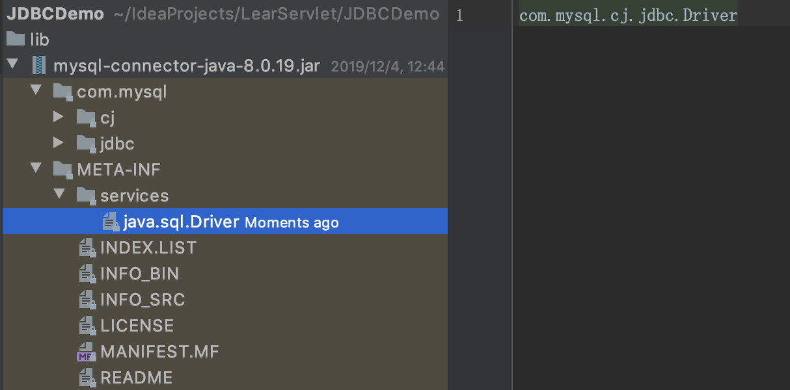

# 常用类

--------------------------------------------------------------------------

### DriverManager

DriverManager主要用来加载驱动.  

**注: ** MySQL老的驱动类使用`com.mysql.jdbc.Driver`, 但8.x之后建议更换为 `com.mysql.cj.jdbc.Driver` 

`Class.forName("com.mysql.cj.jdbc.Driver");`就是把com.mysql.cj.jdbc.Driver这个类的字节码通过类加载器加载到内存  

源代码:  

```java
public class Driver extends NonRegisteringDriver implements java.sql.Driver {
    public Driver() throws SQLException {
    }

    static {
        try {
            DriverManager.registerDriver(new Driver());
        } catch (SQLException var1) {
            throw new RuntimeException("Can't register driver!");
        }
    }
}
```

MySQL5之后, 加载MySQL驱动的这句代码`Class.forName("com.mysql.cj.jdbc.Driver");`可以省略不写, 因为在META-INF/services/java.sql.Driver文件中已描述的驱动类:  

  

一般开发时, 建议还是写上 

获取数据库连接:  
```
static Connection getConnection(String url, String user, String password)
```

- url: 连接路径, 每个数据库都不一样, 以MySQL为例: 
  - 语法 `jdbc:mysql://IP(域名):端口/数据库名称?参数`
  - 示例 `jdbc:mysql://127.0.0.1:3306/daliu?characterEncoding=utf-8&useSSL=false`
  - 细节 如果是本机MySQL, 可以省略IP及端口 `jdbc:mysql:///daliu?characterEncoding=utf-8&useSSL=false`
- user: 用户名
- password: 密码

--------------------------------------------------------------------------

### Connection  

Connection是数据库连接对象, 代表与特定数据库的连接(会话), 每一个Connection代表一个物理连接会话

功能:  
- 获取执行sql的对象 
  - `Statement stmt = conn.createStatement()`
  - `PreparedStatement stmt = conn.prepareStatement(String sql)`
- 管理事务
  - 开启事务 `void setAutoCommit(boolean autoCommit)` 设置false即代表开启事务
  - 提交事务 `void commit()`
  - 回滚事务 `void rollback()`
  - Savepoint setSavepoint()
  - Savepoint setSavepoint(String name)
  - void setTransactionIsolation(int level)
  - void rollback(Savepoint savepoint)

--------------------------------------------------------------------------

### Statement

`public interface Statement extends Wrapper, AutoCloseable`  
- 作用: 用于执行静态SQL语句并返回其生成的结果的对象  
- 注意事项: Statement只作用于静态SQL, 默认情况下, 每个Statement对象只能有一个ResultSet对象同时打开. 因此, 如果一个ResultSet对象的读取与另一个对象的读取交错, 则ResultSet对象必须由不同的Statement对象生成. 
- `boolean execute(String sql)` 执行任意给定的SQL语句, 如果第一个结果是ResultSet对象, 则返回true, 否则返回false(比如更新或没有结果)  
- `int executeUpdate(String sql)` 执行给定的SQL语句, DML(insert, update, delete) 和 DDL(create, alter, drop), 返回的int值表示影响的行数, 比如`update student set score=80.0`, 只影响原来score不是80.0的行数
- `ResultSet executeQuery(String sql)` 执行DQL(select)查询语句