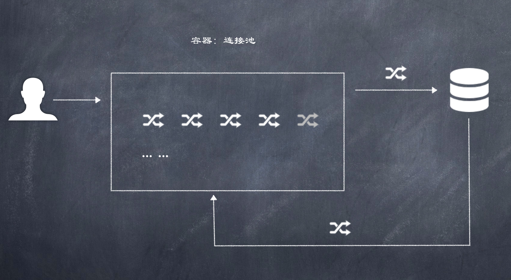

# 连接池

  

连接池又被称为数据源, 在Java中为javax.sql.DataSource接口, 由数据库驱动程序供应商提供  

和数据库建立连接可以使用`DriverManager.getConnection(url, user, password);`但是使用DataSource的方式获取连接有更多优势. 

The classes and interfaces used for connection pooling are:

- ConnectionPoolDataSource
- PooledConnection
- ConnectionEvent
- ConnectionEventListener
- StatementEvent
- StatementEventListener

>  When a ConnectionPoolDataSource object is called on to create a PooledConnection object, the connection pool manager will register as a ConnectionEventListener object with the new PooledConnection object. When the connection is closed or there is an error, the connection pool manager (being a listener) gets a notification that includes a ConnectionEvent object.

### javax.sql.DataSource常用功能
- getConnection() 获取连接
- 归还连接: 如果连接对象Connection是从连接池中获取的, 那么调用conn.close()不会关闭连接, 而是归还到连接池

### 常用数据库连接池实现
- C3P0
- DBCP
- Druid: Ali实现

--------------------------------

### C3P0连接池示例  

**1. 下载并导入jar包**  
[下载地址](https://sourceforge.net/projects/c3p0/), C3P0依赖于`mchange-commons-java-x.x.x.jar`包, 因此导入3p0 jar包时还需要导入`machange-commons-java`  

**2. 定义配置文件**

c3p0有两种使用方式, 第一种是硬编码方式:: 

> import com.mchange.v2.c3p0.*;

```java
ComboPooledDataSource cpds = new ComboPooledDataSource();
cpds.setDriverClass( "org.postgresql.Driver" ); //loads the jdbc driver            
cpds.setJdbcUrl( "jdbc:postgresql://localhost/testdb" );
cpds.setUser("dbuser");                                  
cpds.setPassword("dbpassword");
...
cpds.setMaxStatements( 180 );   
...
cpds.close();
```

第二种是使用配置方式, 可以使用如下几种配置方式: 

- via a simple Java properties file
- via HOCON (typesafe-config) files (if and only if you bundle the typesafe-config library with your application)
- via an XML configuration file
- via System properties  

> Configuration files are normally looked up under standard names (c3p0.properties or c3p0-config.xml) at the top level of an application's classpath, but the XML configuration can be placed anywhere in an application's file system or classpath, if the system propertyc3p0.properties or c3p0-config.xml is set.
> 

即: 配置文件  
- 名称: c3p0.properties 或 c3p0-config.xml
- 路径: 直接将文件放在src目录下(如果使用xml格式, 可以放于任意目录下, 但要求: the system propertyc3p0.properties or c3p0-config.xml is set)  


**2. 创建核心对象, 获取连接**  
`new ComboPooledDataSource().getConnection()`

代码示例:  

```xml
// src目录/c3p0-config.xml
<c3p0-config>
    <default-config>
        <!--连接参数-->
        <property name="driverClass">com.mysql.cj.jdbc.Driver</property>
        <property name="jdbcUrl"><![CDATA[jdbc:mysql://127.0.0.1:3306/daliu?characterEncoding=utf-8&useSSL=false]]></property>
        <property name="user">root</property>
        <property name="password">110</property>

        <!--连接池参数-->
        <property name="initialPoolSize">10</property>
        <property name="maxPoolSize">100</property>
        <property name="minPoolSize">10</property>
        <property name="checkoutTimeout">30000</property>
        <!--
        <property name="automaticTestTable">con_test</property>
        <property name="idleConnectionTestPeriod">30</property>
        <property name="maxIdleTime">30</property>
        <property name="maxStatements">200</property>

        <user-overrides user="test-user">
            <property name="maxPoolSize">10</property>
            <property name="minPoolSize">1</property>
            <property name="maxStatements">0</property>
        </user-overrides>
        -->
    </default-config>

    <!-- This app is massive! -->
    <named-config name="intergalactoApp">
        <!--连接参数-->
        <property name="driverClass">com.mysql.cj.jdbc.Driver</property>
        <property name="jdbcUrl"><![CDATA[jdbc:mysql://127.0.0.1:3306/daliu?characterEncoding=utf-8&useSSL=false]]></property>
        <property name="user">root</property>
        <property name="password">110</property>

        <!--连接池参数-->
        <property name="initialPoolSize">10</property>
        <property name="maxPoolSize">100</property>
        <property name="minPoolSize">10</property>
        <property name="checkoutTimeout">30000</property>

        <!--
        <property name="acquireIncrement">50</property>
        <property name="maxStatements">0</property>
        <property name="maxStatementsPerConnection">5</property>

         he's important, but there's only one of him
        <user-overrides user="master-of-the-universe">
            <property name="acquireIncrement">1</property>
            <property name="initialPoolSize">1</property>
            <property name="minPoolSize">1</property>
            <property name="maxPoolSize">5</property>
            <property name="maxStatementsPerConnection">50</property>
        </user-overrides>
        -->
    </named-config>
</c3p0-config>
```

```java
// -- cn.com.jdbc.C3P0Demo.java --
package cn.com.jdbc;

import com.mchange.v2.c3p0.ComboPooledDataSource;

import javax.sql.DataSource;
import java.sql.Connection;
import java.sql.ResultSet;
import java.sql.SQLException;
import java.sql.Statement;

public class C3P0Demo {
    public static void main(String[] args) throws SQLException {
    	  // 空参数, 默认使用default-config
        // 如果传了字符串值, 则使用具体的config, 比如"intergalactoApp"
        DataSource dataSource = new ComboPooledDataSource();
        Connection conn = dataSource.getConnection();
        System.out.println(conn);
        // com.mchange.v2.c3p0.impl.NewProxyConnection@27f674d [wrapping: com.mysql.cj.jdbc.ConnectionImpl@1d251891]
        // [ acquireIncrement -> 3, acquireRetryAttempts -> 30, acquireRetryDelay -> 1000,
        // autoCommitOnClose -> false, automaticTestTable -> null, breakAfterAcquireFailure -> false,
        // checkoutTimeout -> 30000, connectionCustomizerClassName -> null,
        // connectionTesterClassName -> com.mchange.v2.c3p0.impl.DefaultConnectionTester,
        // contextClassLoaderSource -> caller, dataSourceName -> 1hge139a81kyll1h1j074q7|4534b60d,
        // debugUnreturnedConnectionStackTraces -> false, description -> null,
        // driverClass -> com.mysql.cj.jdbc.Driver, extensions -> {},
        // factoryClassLocation -> null, forceIgnoreUnresolvedTransactions -> false,
        // forceSynchronousCheckins -> false, forceUseNamedDriverClass -> false,
        // identityToken -> 1hge139a81kyll1h1j074q7|4534b60d, idleConnectionTestPeriod -> 0,
        // initialPoolSize -> 10, jdbcUrl -> jdbc:mysql://localhost:3306/daliu/,
        // maxAdministrativeTaskTime -> 0, maxConnectionAge -> 0, maxIdleTime -> 0,
        // maxIdleTimeExcessConnections -> 0, maxPoolSize -> 100, maxStatements -> 0,
        // maxStatementsPerConnection -> 0, minPoolSize -> 10, numHelperThreads -> 3,
        // preferredTestQuery -> null, privilegeSpawnedThreads -> false, properties -> {user=******, password=******},
        // propertyCycle -> 0, statementCacheNumDeferredCloseThreads -> 0,
        // testConnectionOnCheckin -> false, testConnectionOnCheckout -> false,
        // unreturnedConnectionTimeout -> 0, userOverrides -> {},
        // usesTraditionalReflectiveProxies -> false

        Statement stmt = conn.createStatement();
        ResultSet rs = stmt.executeQuery("select * from user;");
        while (rs.next()) {
            // 虽然id是integer类型, 但依然可以通过getString获取
            String name = rs.getString(1) + "\t";
            // int name = rs.getInt(1) + "\t";
            String username = rs.getString(2) + "\t";
            String birthday = rs.getString(2) + "\t";
            String address = rs.getString(3);
            System.out.println(name + username + birthday + address);
        }
        JDBCUtils.close(stmt, conn);
    }
}
```

```java
// -- cn.com.jdbc.JDBCUtils.java --
package cn.com.jdbc;

import java.io.FileReader;
import java.io.IOException;
import java.net.URL;
import java.sql.*;
import java.util.Properties;

public class JDBCUtils {
    private static String url;
    private static String user;
    private static String password;
    private static String driver;
    static {
        // 静态代码块随着类的加载而加载, 只执行一次
        Properties properties = new Properties();
        try {
            // 使用ClassLoader获取src路径下文件
            ClassLoader classLoader = JDBCUtils.class.getClassLoader();
            URL res = classLoader.getResource("jdbc.properties");
            // System.out.println(res.getPath());
            properties.load(new FileReader(res.getPath()));
            url = properties.getProperty("url");
            user = properties.getProperty("user");
            password = properties.getProperty("password");
            driver = properties.getProperty("driver");
            try {
                Class.forName(driver);
            } catch (ClassNotFoundException e) {
                e.printStackTrace();
            }
        } catch (IOException e) {
            e.printStackTrace();
        }
    }

    public static Connection getConnection() throws SQLException {
        return DriverManager.getConnection(url, user, password);
    }

    public static void close(ResultSet rs, Statement stmt, Connection connection) {
        if (rs != null) {
            try {
                rs.close();
            } catch (SQLException e) {
                e.printStackTrace();
            }
        }
        close(stmt, connection);
    }

    public static void close(Statement stmt, Connection connection) {
        if (stmt != null) {
            try {
                stmt.close();
            } catch (SQLException e) {
                e.printStackTrace();
            }
        }
        if (connection != null) {
            try {
                connection.close();
            } catch (SQLException e) {
                e.printStackTrace();
            }
        }
    }
}
```

### 注意
如果数据库连接池max允许为10, 而同时开了11个connection, 由于开不了第11个, 会引起crash:  

```java
package cn.com.jdbc;

import com.mchange.v2.c3p0.ComboPooledDataSource;

import javax.sql.DataSource;
import java.sql.Connection;
import java.sql.SQLException;

public class C3P0Demo {
    public static void main(String[] args) throws SQLException {
        DataSource ds = new ComboPooledDataSource();
        for (int i = 0; i <= 11; i++) {
            Connection conn = ds.getConnection();
            System.out.println(conn);
            // com.mchange.v2.resourcepool.TimeoutException: A client timed out while waiting to acquire a resource from com.mchange.v2.resourcepool.
            // BasicResourcePool@e580929 -- timeout at awaitAvailable()
        }
    }
}
```

-------------------------------------

### druid连接池

1. 下载并导入jar包, 下载地址 [https://github.com/alibaba/druid
http://repo.jenkins-ci.org/public/com/alibaba/druid/](https://github.com/alibaba/druid
http://repo.jenkins-ci.org/public/com/alibaba/druid/) or [https://github.com/alibaba/druid](https://github.com/alibaba/druid)
2. 定义配置文件, 可以是任意形式的properties文件, 路径任意
3. 获取数据库连接池对象, 撸代码  

**src/druid.properties**  

```
driverClassName=com.mysql.cj.jdbc.Driver
url=jdbc:mysql://127.0.0.1:3306/daliu?characterEncoding=utf-8&useSSL=false
username=root
password=110
#初始化连接数
initialSize=5
#最大连接数
maxActive=100
#超时时间
maxWait=3000
```

**cn.com.jdbc.DruidDemo.java**

```java
package cn.com.jdbc;

import com.alibaba.druid.pool.DruidDataSourceFactory;
import com.mchange.v2.c3p0.ComboPooledDataSource;

import javax.sql.DataSource;
import java.io.FileReader;
import java.sql.Connection;
import java.sql.ResultSet;
import java.util.Properties;

public class DruidDemo {
    public static void main(String[] args) throws Exception {
        Properties prop = new Properties();
        prop.load(new FileReader(DruidDemo.class.getClassLoader().getResource("druid.properties").getPath()));
        // OK: prop.load(DruidDemo.class.getClassLoader().getResourceAsStream("druid.properties"));
        DataSource dataSource = DruidDataSourceFactory.createDataSource(prop);
        Connection conn = dataSource.getConnection();
        ResultSet rs = conn.createStatement().executeQuery("select * from user;");
        while (rs.next()) {
            String name = rs.getString(1) + "\t";
            String username = rs.getString(2) + "\t";
            String birthday = rs.getString(2) + "\t";
            String address = rs.getString(3);
            System.out.println(name + username + birthday + address);
        }
    }
}
```

--------------------------------------

### druid连接池工具类封装

**cn.com.jdbc.DruildUtils.java**

```java
package cn.com.jdbc;

import com.alibaba.druid.pool.DruidDataSourceFactory;
import javax.sql.DataSource;
import java.sql.Connection;
import java.sql.ResultSet;
import java.sql.SQLException;
import java.sql.Statement;
import java.util.Properties;

public class DruildUtils {
    private static DataSource dataSource;
    static {
        try {
            Properties prop = new Properties();
            prop.load(DruildUtils.class.getClassLoader().getResourceAsStream("druid.properties"));
            dataSource = DruidDataSourceFactory.createDataSource(prop);
        } catch (Exception e) {
            e.printStackTrace();
        }
    }

    // 获取连接
    public static Connection getConnection() throws SQLException {
        return dataSource.getConnection();
    }

    public static void close(Statement stmt) {
        close(stmt, null, null);
    }

    public static void close(Connection conn) {
        close(null, conn, null);
    }

    public static void close(ResultSet resultSet) {
        close(null, null, resultSet);
    }

    private static void close(Statement stmt, Connection conn, ResultSet resultSet) {
        try {
            if (stmt != null) {
                stmt.close();
            }
            if (conn != null) {
                conn.close(); // 归还到池中
            }
            if (resultSet != null) {
                resultSet.close();
            }
        } catch (Exception e) {
            e.printStackTrace();
        }
    }

    public static DataSource getDataSource() {
        return dataSource;
    }
}
```

**com.daliu.test.DruidDemo.java**  

```java
package com.daliu.test;

import cn.com.jdbc.DruildUtils;

import java.sql.Connection;
import java.sql.PreparedStatement;
import java.sql.SQLException;

public class DruidDemo {
    public static void main(String[] args) throws SQLException {
        Connection connection = null;
        PreparedStatement pstmt = null;
        try {
            connection = DruildUtils.getConnection();
            String sql = "insert into user values(null, ?, ?, ?)";
            pstmt = connection.prepareStatement(sql);
            pstmt.setString(1, "钟南山");
            pstmt.setString(2, "男");
            pstmt.setString(3, "广州市");
            int count = pstmt.executeUpdate();
            System.out.println("共影响" + count + "条记录");
        } catch (SQLException e) {
            e.printStackTrace();
        } finally {
            DruildUtils.close(pstmt);
            DruildUtils.close(connection);
        }
    }
}
```
