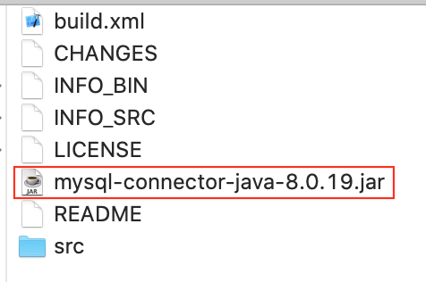

# 配置

### 1. 下载MySQL[驱动jar包](https://dev.mysql.com/downloads/connector/j/)
或者如果使用Maven包管理器, 也可以: 
```xml
<!-- pom.xml -->
<dependencies>
    <dependency>
        <groupId>mysql</groupId>
        <artifactId>mysql-connector-java</artifactId>
        <version>5.1.47</version>
    </dependency>
</dependencies>
```

下载下来mysql-connector-java-x.x.xx.zip后解压找到mysql-connector-java-x.x.xx-bin.jar, 此jar包即是驱动jar包, 需要把它导入到项目中    
一般在项目中添加一个libs目录, 然后把jar包拷贝进去, 右键libs目录 > Add as Library


### 2. 注册驱动  
### 3. 获取数据库连接对象Connection
### 4. 执行SQL语句
...

示例:  

```java

import java.sql.*;

// DriverManager.getConnection(String url, String user, String pass)
// url: jdbc:subprotocol:other stuff
// jdbc:mysql://hostname:port/databasename
// oracle: oracle:thin:@hostname:port:databasename
public class ConnMySql {
    public static void main(String[] args) throws Exception {
        // 1. 加载驱动
        // 老方式： Class.forName("com.mysql.jdbc.Driver");
        Class.forName("com.mysql.cj.jdbc.Driver");
        // 2. 使用DriverManager获取数据库连接
        // 注：MySQL高版本需要指明SSL连接
        // 可以设置useSSL=false禁用SSL，或设置useSSL=true并为服务器证书验证提供信任库
        try(Connection conn = DriverManager.getConnection("jdbc:mysql://127.0.0.1:3306/daliu?characterEncoding=utf-8&useSSL=false", "root", "110");
            // 3. 使用Connection创建Statement对象
            Statement stmt = conn.createStatement();
            // 4. 执行SQL语句
            ResultSet rs = stmt.executeQuery("select s.*, t.name from student s, teacher t where t.name=s.name;");
        ) {
            while (rs.next()) {
                System.out.println(rs.getString(1) + "\t"
                + rs.getString(2) + "\t"
                + rs.getString(3) + "\t");
            }
        }
    }
}
```