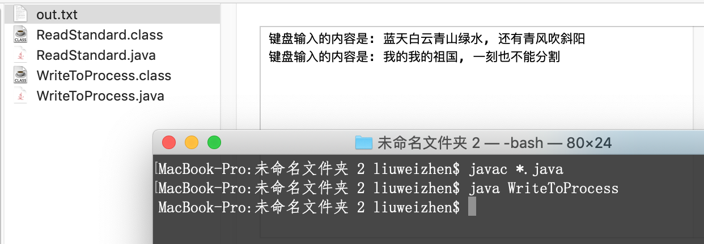

# Runtime

每个Java程序都有一个与之对应的Runtime实例, 通过Runtime.getRuntime()获取, 不可新建.

```java
public class RantimeTest {
    public static void main(String[] args) {
        Runtime runtime = Runtime.getRuntime();
        System.out.println("处理器个数: " + runtime.availableProcessors());
        System.out.println("空闲内存: " + runtime.freeMemory());
        System.out.println("总内存: " + runtime.totalMemory());
        System.out.println("可用最大内存: " + runtime.maxMemory());
        try {
            // 执行命令
            Process process = runtime.exec("/Users/liuweizhen/Desktop/ForDelete/do.command");
            System.out.println(process.toString()); // java.lang.UNIXProcess@1d81eb93
        } catch (Exception ex) {
            ex.printStackTrace();
        }
    }
}
```

注意: `runtime.exec("/Users/liuweizhen/Desktop/Doc/do.command");` 这句代码通过exec启动平台上的命令之后,它就变成了一个进程, Java使用Process代表进程, 在运行这句代码之前, 假设相应目录下已存在此shell脚本文件`do.command`:

本机试验环境: Mac OS

```shell
cd /Users/liuweizhen/Desktop/Doc # 进入到目录.../Doc
mkdir test # 新建文件夹test
cd test # 进入到test目录下
touch my.txt # 新建一个名叫my.txt的文件
echo "hello world" > my.txt # 往my.txt中写入"hello world"字符串
```

对于do.command文件, 还需要授权, 调用 `sudo chmod +x do.command`即可.

运行了上面的Java程序之后, 会发现在`/Users/liuweizhen/Desktop/Doc`下生成了`test/my.txt`文件, 其中的内容是`hello world`

### Java虚拟机读写其他进程数据

使用Runtime对象的exec()方法可以运行平台上的其他程序, 该方法产生一个Process对象, Process对象代表由该Java程序启动的子线程, Process类提供了如下三个方法, 用于让程序和其子进程进行通信:

- InputStream getErrorStream() 获取子进程的错误流
- InputStream getInputStream() 获取子进程的输入流
- OutpuStream getOutputStream() 获取子进程的输出流

这面的输入流还是输出流要以Java程序的角度看, 如果让子进程读取Java程序中的数据, 这就是输出流, 因为需要Java程序输出到子进程.  子进程读取Java程序的数据, 就是让Java程序输出数据到子进程, 就像把数据输出到文件中一样, 只是现在由子进程节点代替了文件节点. 相反, 如果是Java程序从子进程中读取数据, 这就是输入流.

举例说明输入流, 即由Java程序读取子进程的数据, 比如在控制台运行`javac`, 控制台输出如下:
```java
$ javac -help
用法: javac <options> <source files>
其中, 可能的选项包括:
  -g                         生成所有调试信息
  -g:none                    不生成任何调试信息
  -g:{lines,vars,source}     只生成某些调试信息
  -nowarn                    不生成任何警告
  -verbose                   输出有关编译器正在执行的操作的消息
  -deprecation               输出使用已过时的 API 的源位置
  ...
```

这是因为调用javac命令缺少参数, 因此javac进程会把信息当做错误流输出出来, 我们使用Java程序读取子进程`javac`的错误输出流(相对于下面的Java程序而言, javac的错误输出流即Java程序的输入流)数据: 

```java
import java.io.BufferedReader;
import java.io.IOException;
import java.io.InputStreamReader;

public class ReadFromProcess {
    public static void main(String[] args) throws IOException {
        Process process = Runtime.getRuntime().exec("javac");
        try (
                InputStreamReader inputStreamReader = new InputStreamReader(process.getErrorStream());
                BufferedReader reader = new BufferedReader(inputStreamReader);
                ) {
            String buffer = null;
            while ((buffer = reader.readLine()) != null) {
                System.out.println(buffer);
            }
        }
    }
}
```

不仅如此, 可以通过`Process`的`getOutputStream()`方法获得向进程输入数据的流(该流对Java程序是输出流, 因为是从Java程序输出信息到进程, 对于进程来说是输入流), 下面程序示范了在Java程序中启动Java虚拟机运行另一个Java程序, 并向另一个Java程序中输入数据.

```java
// -- WriteToProcess.java --
import java.io.IOException;
import java.io.PrintStream;

public class WriteToProcess {
    public static void main(String[] args) throws IOException {
        Process process = Runtime.getRuntime().exec("java ReadStandard");
        try (
                // 以process的输出流创建PrintStream对象
                // 这个输出流对本程序是输出流, 对process进程是输入流, 由本程序输出信息到process进程
                PrintStream printStream = new PrintStream(process.getOutputStream());
                ) {
            printStream.println("蓝天白云青山绿水, 还有青风吹斜阳");
            printStream.println("我的我的祖国, 一刻也不能分割");
        }
    }
}
```

```java
// -- ReadStandard.java --
import java.io.IOException;
import java.io.PrintStream;

public class WriteToProcess {
    public static void main(String[] args) throws IOException {
        Process process = Runtime.getRuntime().exec("java ReadStandard");
        try (
                // 以process的输出流创建PrintStream对象
                // 这个输出流对本程序是输出流, 对process进程是输入流, 由本程序输出信息到process进程
                PrintStream printStream = new PrintStream(process.getOutputStream());
                ) {
            printStream.println("蓝天白云青山绿水, 还有青风吹斜阳");
            printStream.println("我的我的祖国, 一刻也不能分割");
        }
    }
}
```



下面我们修改一下上面的command文件, 并让Java程序读取该command进程的输入数据:
```shell
// -- /Users/liuweizhen/Desktop/Doc/do.command --
echo "大师兄, 师傅被妖怪抓走了"
echo "呆子, 看打!"
```

```java
import java.io.BufferedReader;
import java.io.IOException;
import java.io.InputStreamReader;
import java.lang.Runtime;

public class ReadFromShell {
    public static void main(String[] args) throws IOException {
        Process process = Runtime.getRuntime().exec("/Users/liuweizhen/Desktop/Doc/do.command");
        try (
                InputStreamReader inputStreamReader = new InputStreamReader(process.getInputStream());
                BufferedReader reader = new BufferedReader(inputStreamReader);
                ) {
            String buffer = null;
            while ((buffer = reader.readLine()) != null) {
                System.out.println(buffer);
            }
        }
    }
}
```

程序运行结果:

```
大师兄, 师傅被妖怪抓走了
呆子, 看打!
```

