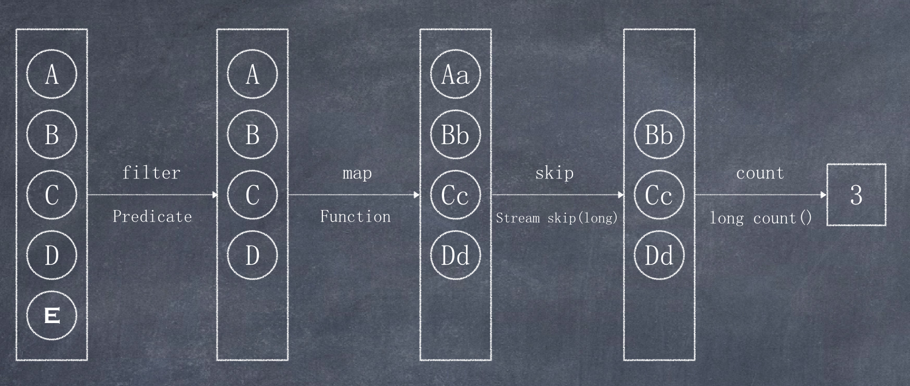

# Stream流思想

Java8中, 得益于Lambda所带来的函数式编程, 引入了Stream概念, 这里的Stream流并非I/O流, 而是一种程序设计思想  

比如, 几乎所有的集合(如`Collection`接口或`Map`接口等)都支持直接或间接的遍历操作. 我们可以把集合和数组转换为Stream流, 然后使用Stream流中的方法对集合和数组中的元素进行操作.  

示例:  

先看一个传统写法:  

```java
import java.util.ArrayList;
import java.util.List;

public class StreamDemo {
    public static void main(String[] args) {
        List<String> list = new ArrayList<String>() {
            {
                add("张三丰");
                add("张宇");
                add("大刘");
                add("张无忌");
                add("乔峰");
                add("刘德华");
            }
        };

        // 第一步: 找出姓张的同学
        List<String> zhangList = new ArrayList<>();
        for (String name : list) {
            if (name.startsWith("张")) {
                zhangList.add(name);
            }
        }

        // 第二步: 再从姓张的同学中找出名字长度为2的同学
        List<String> shortList = new ArrayList<>();
        for (String name : zhangList) {
            if (name.length() == 2) {
                shortList.add(name);
            }
        }

        // 第三步: 再把最终结果打印出来
        for (String student : shortList) {
            System.out.println(student); // 张宇
        }
    }
}
```

使用Stream流思想后的写法:  

```java
import java.util.ArrayList;
import java.util.List;

public class StreamDemo2 {
    public static void main(String[] args) {
        List<String> list = new ArrayList<String>() {
            {
                add("张三丰");
                add("张宇");
                add("大刘");
                add("张无忌");
                add("乔峰");
                add("刘德华");
            }
        };

        // Stream<T> filter(Predicate<? super T> predicate);
        // void forEach(Consumer<? super T> action);
        list.stream()
                .filter(name -> name.startsWith("张"))
                .filter(name -> name.length() == 2)
                .forEach(name -> System.out.println(name));
    }
}
```



上图展示了filter(过滤)、map(映射)、skip(跳过)、count(计数)等多步操作, 这是一种集合元素的处理方案, 而方案就是一种"函数模型", 图中每一个长方框都是一个"流", 调用指定的方法, 可以从一个流模型转换为另一个流模型. 而最右侧的数据3是最终结果.  

这里的f`ilter, map, skip`都是在对函数模型进行操作, 集合元素并没有真正被处理. 只有当终结方法`count`执行的时候, 整个模型才会按照指定策略执行操作。而这得益于Lambda的延迟执行特性。  

> 备注:“Stream流”其实是一个集合元素的函数模型，它并不是集合，也不是数据结构，其本身并不存储任何 元素(或其地址值)  
> 

Stream(流)是一个来自数据源的元素队列
- 元素是特定类型的对象，形成一个队列。 Java中的Stream并不会存储元素，而是按需计算。
- **数据源** 即流的来源。 可以是集合，数组 等。   
和以前的Collection操作不同， Stream操作还有两个基础的特征:
- **Pipelining**: 中间操作都会返回流对象本身。 这样多个操作可以串联成一个管道， 如同流式风格(fluent style)。 这样做可以对操作进行优化， 比如延迟执行(laziness)和短路( short-circuiting)。
- **内部迭代**: 以前对集合遍历都是通过Iterator或者增强for的方式, 显式的在集合外部进行迭代， 这叫做外部迭 代。 Stream提供了内部迭代的方式，流可以直接调用遍历方法。  
当使用一个流的时候，通常包括三个基本步骤:获取一个数据源(source)→ 数据转换→执行操作获取想要的结 果，每次转换原有 Stream 对象不改变，返回一个新的 Stream 对象(可以有多次转换)，这就允许对其操作可以 像链条一样排列，变成一个管道。