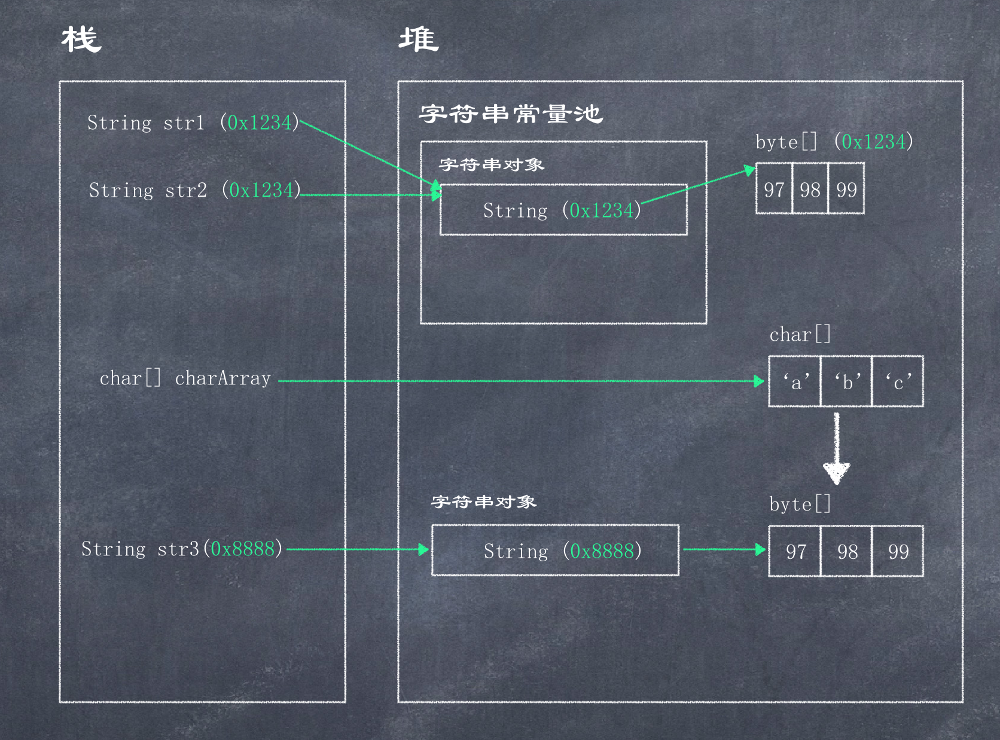

# String

java.lang.String类代表字符串, Java程序中的所有字符串字面值(如"abc")都作为此类的实例的实现. 也就是说即使没有new, 也是String对象, 字符串的内容永不可变, 可以共享使用, 字符串效果上是char[]字符数组, 但底层原理是byte[]字节数组.  

```java
public static void main(String[] args) {
    String str1 = new String();
    System.out.println(str1);

    char[] charArray = {'A', 'B', 'C'};
    String str2 = new String(charArray);
    System.out.println(str2); // ABC

    byte[] byteArray = {97, 98, 99};
    String str3 = new String(byteArray);
    System.out.println(str3); // abc

    String str = "hello"; // str虽然没有new, 但依然是字符串对象
}
```

### 字符串常量池

字符串常量池: 程序当中直接写上的双引号字符串, 就在字符串常量池中, 字符串常量池在堆中  
new的不在池当中
对于引用类型来说, ==是进行地址值的比较  

```java
public class ScannerDemo {
    public static void main(String[] args) {
        String str1  = "abc";
        String str2  = "abc";
        char[] chars = {'a', 'b', 'c'};
        String str3  = new String(chars);
        System.out.println(str1 == str2); // true
        System.out.println(str1 == str3); // false
        System.out.println(str2 == str3); // false
    }
}
```



所以字符串内容的比较一般如下: 

```java
System.out.println(str2.equals(str3)); // true
System.out.println(str2.compareTo(str3) == 0); // true
System.out.println(str2.contentEquals(str3)); // true
System.out.println(str2.equalsIgnoreCase(str3)); // true
```

### split

```java
public static void main(String[] args) {
    String str = "XXX.YYY.ZZZ";
    // split后跟的是正规表达式, 如果以"."分割, 则需要写"\\."
    String[] list = str.split("\\.");
    for (String s : list) {
        System.out.println(s);
    }
}
```