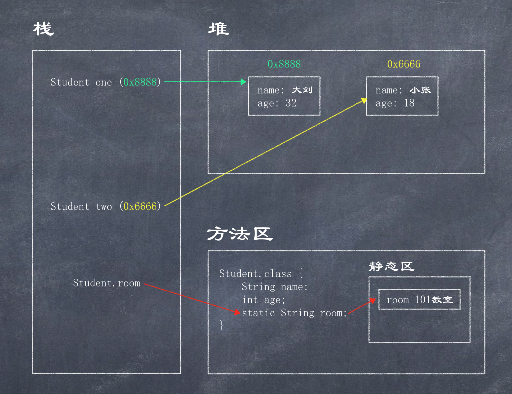
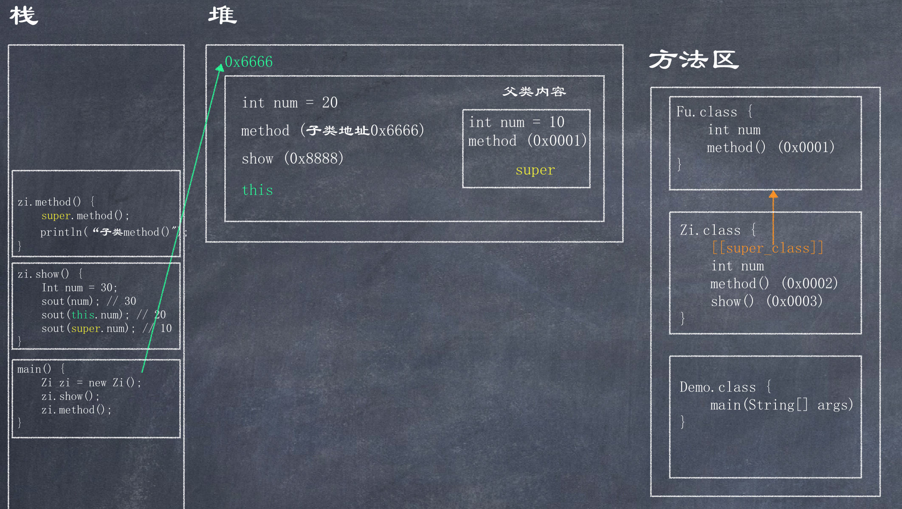

# 内存管理


### Java内存需要划分成为5个部分  

**栈(Stack)**: 存放的都是方法中的局部变量.  

- 局部变量: 方法的参数, 或者方法{}内部的变量   
- 作用域: 一旦超出作用域, 立刻从栈内存中消失  

**堆(Heap)**: 凡是new出来的东西, 都在堆当中  
- 堆内存里面的东西都有一个地址值  
- 堆内存里面的数据, 都有默认值, 规则:  
  - 整数: 0
  - 浮点数: 0.0
  - 字符: '\u0000'
  - 布尔: false
  - 引用类型: null

**方法区(Method Area)**: 存储.class相关信息, 包含方法的信息   
方法区只是记录方法的信息, 而真正方法的运行是在栈中  

**本地方法栈(Native Method Stack)**: 与操作系统相关  

**寄存器(pc Register)**: 与CPU相关  

### 垃圾回收

创建之后 --------> 可达状态 <-------失去引用/重新获得引用------> 可恢复状态 ------彻底失去引用(finalize执行之后)------> 不可达状态 ------> 垃圾回收

`System.gc()`和`Runtime.getRuntime().gc()`告诉垃圾回收器进行清理，但它不一定立即行动。
在垃圾回收器回收某个对象之前总会调用该对象的finalize()方法，此方法是Object的protected方法，因此任何子类都可以重写并在其中释放该对象所占用的资源，不过在实际开发中一般不会在这个方法中释放资源，因为该方法什么时候得到执行是透明(不可知)的。

永远不要直接调用someObj.finalize()方法，不过可以调用`Runtime().getRuntime().runFinalization()`强制垃圾回收机制调用可恢复对象的finalize()方法。


```java
public class GcTest {
    private static GcTest t = null;
    public void info() {
        System.out.println("finalize()方法得到调用，给t赋值了");
    }
    public void finalize() {
      	// 在finalize方法中让即将被释放的当前对象重新获取引用, 让当前对象不被释放
        t = this;
    }
    public static void main(String[] args) {
        new GcTest();
        System.gc();
        // OK: Runtime.getRuntime().runFinalization();
        System.runFinalization(); // 此方法之后, 会走finalize方法让该对象重新得到引用, 如果在finalize方法中没有对当前对象重新引用,则t.info()会报空指针异常
        t.info();
    }
}
```

### 强软引用、弱引用、虚引用

1. 强引用 Strong reference
2. 软引用 Soft reference
3. 弱引用 Weak reference
4. 虚引用 Phantom reference

强 > 软 > 弱  虚(作用不同)

**强引用**
这是默认形式

**软引用**
Soft reference: 内存足够时不会被回收，内存不足时，可能回收。

**弱引用**
Weak reference: 类似于软引用，但级别更低，当gc工作时，弱引用的对象就会被回收。

**虚引用**
Phantom reference: 虚引用主要用于跟踪对象被垃圾回收的状态，虚引用本身不能单独使用，必须和引用队列`ReferenceQueue`联合使用

**引用队列**
引用队列`java.lang.ReferenceQueue`用于保存被回收后对象的引用。当联合使用软引用、弱引用和引用队列时，系统在回收被引用的对象**之后**，将把被回收的对象对应的引用添加到关联的引用队列中。与软弱引用不同的是，使用虚引用会在对象被释放**之前**放入引用队列，这使得可以在对象被回收之前采取行动。

**弱引用示例**

```java
import java.lang.ref.WeakReference;

public class ReferenceTest {
    public static void main(String[] args) {
        String str = new String("Hello world!");
        // 和str对象关联的弱引用wr
        WeakReference wr = new WeakReference(str);
        // 切断str引用
        str = null;
        // 取出弱引用引用的对象
        System.out.println(wr.get()); // Hello world!
        System.gc();
        System.runFinalization();
        System.out.println(wr.get()); // null
    }
}
```

**虚引用示例**
虚引用无法获取它引用的对象
当被虚引用引用的对象即将被释放，虚引用将被添加到引用队列中:

```java
import java.lang.ref.PhantomReference;
import java.lang.ref.ReferenceQueue;

public class PhantomReferenceTest {
    public static void main(String[] args) {
        String str = new String("你好中国");
        ReferenceQueue queue = new ReferenceQueue();
        PhantomReference ref = new PhantomReference(str, queue);
        str = null;
        System.out.println(ref.get()); // null
        System.gc();
        System.runFinalization();
        // 垃圾回收回收了ref所引用的对象后，ref被添加到引用队列queue中
        System.out.println(queue.poll() == ref);
        System.out.println(ref.get()); // null
    }
}
```

**常见写法**
由于软弱引用可能随时被gc回收，因此使用时常用写法：

```java
obj = weakRef.get();
if (obj == null) {
	// 如果对象已被释放，重新创建一个对象并强引用它
	obj = new SomeObject();
	weakRef = new WeakReference(obj);
	// 业务逻辑Here
	// ...
}
// 再次切断obj和对象之间的关联
obj = null;
```

### static内存图  

```java
public class Test {
    public static void main(String[] args) {
        Student one = new Student("大刘", 32);
        Student two = new Student("小张", 20);
        Student.room = "101教室";
    }
}
```



### 继承关系结构中内存图 

```java
public class Fu {
    int num = 10;
    public void method() {
        System.out.println("父类method()");
    }
}

public class Zi extends Fu {
    int num = 20;

    @Override
    public void method() {
        super.method();
        System.out.println("子类method()");
    }

    public void show() {
        int num = 30;
        System.out.println(num);       // 30
        System.out.println(this.num);  // 20
        System.out.println(super.num); // 10
    }
}

public class Demo {
    public static void main(String[] args) {
        Zi zi = new Zi();
        zi.show();
        zi.method();
    }
}
```


