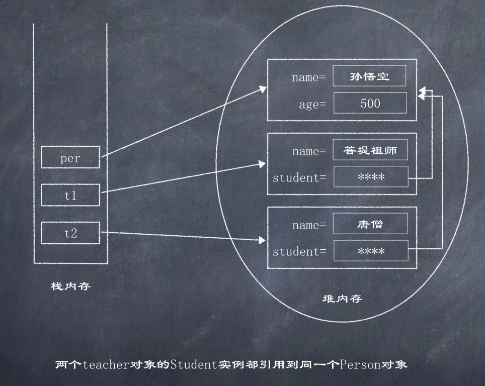
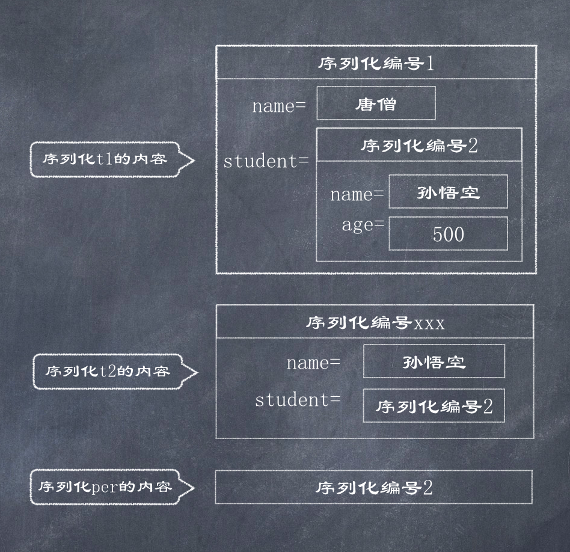

# 对象引用的序列化

如果某个类的成员变量的类型不是基本类型或String类型, 而是引用类型, 则这个引用类必须是可序列化的, 否则拥有该类型成员变量的类也是不可序列化的  

如下Teacher类持有一个Person类的引用, 只有Person类是可序列化的, Teacher类才可以是可序列化的.  

```java
public class Teacher implements java.io.Serializable {
    private String name;
    private Person person;
    public Teacher(String name, Person person) {
        this.name = name;
        this.person = person;
    }
    //... getters & setters
}
```

当程序序列化一个Teacher对象时, 如果该Teacher对象持有一个Person对象的引用, 为了在反序列化时可以正常恢复该Teacher对象, 程序会顺带将该Person对象也进行序列化, 所以Person类也必须是可序列化的, 否则Teacher类将不可序列化.  

---------------------------------------

### 序列化编号  

现在假设有如下一种特殊情形, 有两个Teacher对象, 它们的student实例变量都引用同一个Person对象, 而且该Person对象还有一个引用变量引用它:  

```java
Person per = new Person("孙悟空", 500);
Teacher t1 = new Teacher("唐僧", per);
Teacher t2 = new Teacher("菩提祖师", per);
```

  

于是, 产生了一个问题: 如果先序列化t1对象, t1所引用的Person对象一起序列化; 如果再序列化t2对象, 系统一样会序列化该Person对象, 如果再显示序列化per对象, 系统将再次序列化该Person对象, 那么这个过程似乎会向输出流中输出三个Person对象, 如果是这样, 那么当反序列化时将会得到三个Person对象, 从而引起t1.student不等于 t2.student, 这就违背了Java序列化的初衷.  

为了解决这种问题, Java序列化机制采用了一种特殊的序列化算法:  
- 所有保存到磁盘中的对象都有一个序列化编号
- 当程序试图序列化一个对象时, 程序将先检查该对象是否已经被序列化过, 只有该对象从未(在本次虚拟机中)被序列化过, 系统才会将该对象转换成字节序列并输出   
- 如果某个对象已经序列化过, 程序将只是直接输出一个序列化编号, 而不是再次重新序列化该对象  

根据上面序列化算法, 可以得到一个结论 ---- 当第二次, 第三次序列化Person对象时, 程序不会再次将Person对象转换成字节码并输出, 而是仅仅输出一个序列化编号, 假设有如下顺序的序列化代码:  

```java
objectOutputStream.writeObject(t1);
objectOutputStream.writeObject(t2);
objectOutputStream.writeObject(per);
```

通过该机制可知, 当多次调用writeObject()方法输出同一个对象时, 只有第一次才会将该对象转换成字节序列并输出  



**Person.java**

```java
import java.io.Serializable;

public class Person implements Serializable {
    private String name;
    private int age;

    public Person(String name, int age) {
        this.name = name;
        this.age = age;
    }

    public String getName() {
        return name;
    }

    public void setName(String name) {
        this.name = name;
    }

    public int getAge() {
        return age;
    }

    public void setAge(int age) {
        this.age = age;
    }
}
```

**Teacher.java**  
```java
public class Teacher implements java.io.Serializable {
    private String name;
    private Person student;

    public String getName() {
        return name;
    }

    public void setName(String name) {
        this.name = name;
    }

    public Person getStudent() {
        return student;
    }

    public void setStudent(Person student) {
        this.student = student;
    }

    public Teacher(String name, Person person) {
        this.name = name;
        this.student = person;
    }
}
```

**Test.java**  
```java
import java.io.*;

public class Test {
    public static void main(String[] args) {
        write();
        read();
    }

    private static void write() {
        try (ObjectOutputStream outStream = new ObjectOutputStream(new FileOutputStream("teacher.txt"))) {
            Person per = new Person("孙悟空", 500);
            Teacher t1 = new Teacher("唐僧", per);
            Teacher t2 = new Teacher("菩堤老祖", per);
            // 依次将4个对象写入输出流
            outStream.writeObject(t1);
            outStream.writeObject(t2);
            outStream.writeObject(per);
            outStream.writeObject(t2);
        } catch (IOException e) {
            e.printStackTrace();
        }
    }

    private static void read() {
        try (ObjectInputStream inStream = new ObjectInputStream(new FileInputStream("teacher.txt"))) {
            // 和写入顺序一致
            // 依次读取ObjectInputStream输入流中的4个对象
            Teacher t1 = (Teacher) inStream.readObject();
            Teacher t2 = (Teacher) inStream.readObject();
            Person per = (Person) inStream.readObject();
            Teacher t3 = (Teacher) inStream.readObject();
            System.out.println(t1.getStudent() == per); // true
            System.out.println(t2.getStudent() == per); // true
            System.out.println(t2 == t3); // true
        } catch (IOException | ClassNotFoundException e) {
            e.printStackTrace();
        }
    }
}
```

---------------------------------------

### 序列化机制问题  

由于Java序列化的机制使然: 如果多次序列化同一个Java对象, 只有第一次序列化时才会把Java对象转换成字节序列并输出, 这样可能引起一个潜在的问题----当程序序列化一个可变对象时, 只有第一次使用writeObject()方法输出时才会将该对象转换成字节序列并输出, 当程序再次调用writeObject()方法时, 程序只是输出前面的序列化编号, 即使后面该对象的实例变量已改变, 改变的实例变量值也不会被输出  

```java
import java.io.FileInputStream;
import java.io.FileOutputStream;
import java.io.ObjectInputStream;
import java.io.ObjectOutputStream;

public class Test2 {
    public static void main(String[] args) {
        try (
             // 注: input stream 放在前面会导致Crash: File not found
             ObjectOutputStream oos = new ObjectOutputStream(new FileOutputStream("mutable.txt"));
             ObjectInputStream ois = new ObjectInputStream(new FileInputStream("mutable.txt"))) {
            Person per = new Person("孙悟空", 500);
            oos.writeObject(per);
            per.setName("八戒");
            oos.writeObject(per);
            Person p1 = (Person) ois.readObject();
            Person p2 = (Person) ois.readObject();
            System.out.println(p1 == p2); // true
            System.out.println(p2.getName()); // 孙悟空
        } catch (Exception e) {
            e.printStackTrace();
        }
    }
}
```

