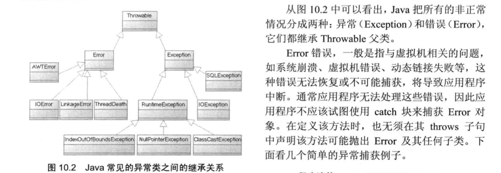

# 异常



```java
public class DivTest {
    public static void main(String[] args) {
        try {
            int a = Integer.parseInt(args[0]);
            int b = Integer.parseInt(args[1]);
            int c = a / b;
            System.out.println("divide value: " + c);
        } catch (IndexOutOfBoundsException ie) {

        } catch (NumberFormatException ne) {
					
        } catch (ArithmeticException ae) {

        } catch (Exception e) {

        } finally {

        }
    }
}
```

Java7之后可以多异常捕获：

```
catch (IndexOutOfBoundsException | NumberFormatException | ArithmeticException e) { 
    e.printStackTrace();
    e.getMessage();
    e.getLocalizedMessage();
    e.getCause();
    e.printStackTrace();
    e.getStackTrace();
    // ...
}
```

### 使用finally回收资源

```java
import java.io.FileInputStream;
import java.io.IOException;

public class FinallyTest {
    public static void main(String[] args) {
        FileInputStream inputStream = null;
        try {
            inputStream = new FileInputStream("a.txt");
        } catch (IOException exception) {
            System.out.println(exception.getMessage());
            return; // 即使这里写了return, finally块也会得到执行
            // System.exit(1); // 这句代码可能导致finally无法执行
        } finally {
            if (inputStream != null) {
                try {
                    inputStream.close();
                } catch (IOException e) {
                    e.printStackTrace();
                }
            }
            System.out.println("执行finally块里的资源回收！");
        }
    }
}
```

**注：** 通常情况下， 不要在finally块中使用如return或throw等导致方法终止的语句，一旦在finally块中使用了return或throw语句，将会导致try块、catch块中的return、throw语句失效：

```java
try {
    // ...
    // 因为finally块中包含了return语句
    // 所以下面的return语句失去作用
    return true;
} finally {
    return false;
}
```

当Java程序执行try块、catch块时遇到了return或throw语句，系统并不会马上结束该方法，而是先去寻找该异常处理流程中是否包含finally块，如果没有finally块，程序立即执行return或throw语句，方法终止；如果有finally块，系统立即开始执行finally块，只有当finally块执行完成后，系统才会再次跳回来执行try块、catch块里的return或throw语句；如果finally块里也使用了return或throw等导致方法终止的语句，finally块已经终止了方法，系统将不会再跳回去执行try块、finally块里的任何代码。

### Java 7的自动关闭资源的try语句

Java 7之前，关闭资源一般形如：
```java
try {
	inputStream = new FileInputStream("a.txt");
} catch (IOException exception) {
	...
} finally {
if (inputStream != null) {
	inputStream.close();
}
```

Java 7增强了try语句的功能，允许在try关键字后紧跟一对圆括号，在这个括号里可以声明和初始化需要在finally中释放的资源，try语句结束后系统会自动关闭这些资源，要求是这些资源实现类必须实现AutoCloseable或Closeable接口，实现这两个接口就必须实现close()方法。

AutoCloseable接口里的close()方法声明抛出Exception。Closeable是AutoCloseable的子接口，其close()方法声明抛出了IOException。

示例：

```java
public class AutoCloseTest {
    public static void main(String[] args) throws IOException { // 也可以不throws异常，不抛的话就需要在try后面catch
        try (   // 声明、初始化两个可关闭的资源
                // try语句会自动关闭这两个资源
                BufferedReader br = new BufferedReader(new FileReader("hello.java"));
                PrintStream ps = new PrintStream(new FileOutputStream("a.txt"));
             )
        {
            System.out.println(br.readLine());
            ps.println("hello");
        }
    }
}
```

上面程序中初始化了两个IO流、由于BufferedReader、PrintStream都实现了Closeable接口，而且它们放在try语句中声明、初始化，
所以try语句会自动关闭它们。自动关闭资源的try语句相当于包含了隐式的finally块。
Java7几乎把所有的"资源类"（包括文件IO的各种类、JDBC编程的Connection, Statement等接口）进行了改写，改写后资源类都实现了AutoCloseable或Closeable接口.

### 使用throws抛出异常

Java程序有Checked异常和Runtime异常(RuntimeException及其子类)之分。Java认为Checked异常都是可以被处理的异常，所以Java程序必须显式处理Checked异常。如果程序没有处理Checked异常，则程序无法通过编译。

使用Checked异常要注意两个缺点：

1. Java要求必须显式捕获并处理异常或显式声明抛出异常
2. 如果子类重写父类带抛出异常的方法，则该方法抛出的异常类型应该是父类方法声明抛出的异常类型的子类或相同，子类方法声明抛出的Checked异常不允许比父类方法声明抛了的Checked异常多

```java
public class Father {
    public void test() throws IOException {
        FileInputStream inputStream = new FileInputStream("a.txt");
    }
}

public class Sub extends Father {
    @Override
    // 错误，子类throws的Checked异常必须和父类throws的相同或是父类throws的子类
    public void test() throws Exception {
        super.test();
    }
}
```


```java
public class Father {
    public void test() throws IOException {
        FileInputStream inputStream = new FileInputStream("a.txt");
    }
}

public class Sub extends Father {
    @Override
    // 错误，子类throws的Checked异常数量要<=父类throws的异常数量
    public void test() throws IOException, SQLException {
        super.test();
    }
}
```

以上是Checked异常的限制，但Runtime异常比较灵活，Runtime异常无须显式声明抛出(throws)，一般也不会对Runtime异常显式throws， 如果程序需要捕获Runtime异常，也可以使用try...catch块来实现。鉴于此，一般推荐使用Runtime异常，而不是Checked异常，尤其当程序需要自行抛出异常时(throw, 不是throws)，使用Runtime异常将更加简洁。

### 使用throw抛出异常

如果throw语句招抛出的异常是Checked异常，则该throw语句要么处理try块里，显式捕获该异常，要么放在一个带throws声明抛出的方法中，把该异常交给该方法的调用者处理；如果throw语句抛出的异常是Runtime异常，则该语句无须放在try块里，也无须放在带throws声明抛出的方法中；程序既可以显式使用try...catch来捕获并处理该异常，也可以完全不理会该异常，把该异常交给该方法调用者处理。

```java
public class ThrowTest {
    public static void main(String[] args) {
        try {
            // 调用声明抛出Checked异常的方法，要么显式捕获该异常
            // 要么在main方法中再次声明抛出
            throwChecked(-3);
        } catch (Exception e) {
            System.out.println(e.getMessage());
        }
        // 调用声明抛出Runtime异常的方法既可以显式捕获该异常
        // 也可以不理会该异常
        throwRuntime(-2);
    }

    public static void throwChecked(int a) throws Exception {
        if (a < 0) {
            // 自行抛出Exception异常(这是Checked异常)
            // 该代码必须位于try块里，或位于带throws声明的方法中
            throw new Exception("Exception: a should be >= 0");
        }
    }
    public static void throwRuntime(int a) {
        if (a < 0) {
            // 抛出RuntimeException异常，既可以显式捕获该异常
            // 也可以完全不理会
            throw new RuntimeException("RuntimeException: a should be >= 0");
        }
    }
}
```

通过上例可知，自行抛出Runtime异常比自行抛出Checked异常灵活性更好。同样，抛出Checked异常可以让编译器提醒程序员必须处理该异常。

### 自定义异常类

```java
// 自定义Checked异常继承于Exception
// 自定义Runtime异常继承于RuntimeException
public class CustomException extends Exception {
    // 自定义异常类一般要实现无参构造器
    public CustomException() {}
    // 自定义异常类一般要实现带一个字符串参数的构造器
    // 用以exception.getMessage()提供信息
    public CustomException(String msg) {
        super(msg);
    }
}
```

### Java 7增强的throw语句

```java
import java.io.FileNotFoundException;
import java.io.FileOutputStream;

public class ThrowTest {
    public static void main(String[] args) throws FileNotFoundException {
        try {
            new FileOutputStream("a.txt");
        } catch (Exception ex) {
            ex.printStackTrace();
            // Java 7会检查下面这行代码并推断出抛出的异常应该为FileNotFoundException
            // 因此main方法只要throws FileNotFoundException即可
            throw ex;
        }
    }
}
```


