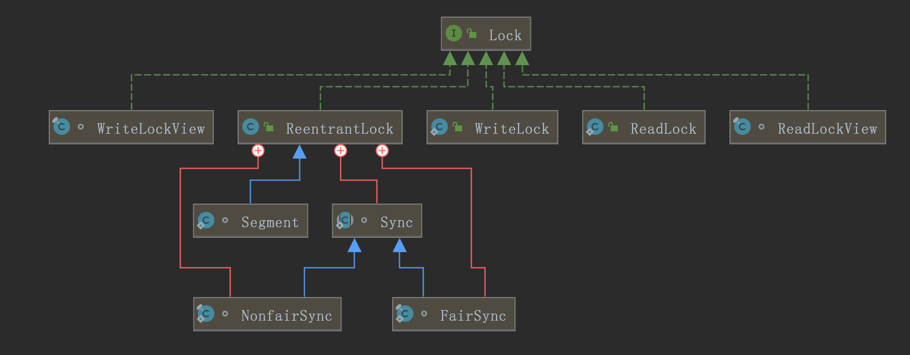

# Lock

Lock接口位于: `java.util.concurrent.locks`包中, 它有一些系统实现类:  



lock的一些常用方法:  

- void lock() 获取锁
- void lockInterruptibly() 如果当前线程未被中断, 则获取锁
- Condition newCondition() 返回绑定到此Lock实例的新Condition实例 
- boolean tryLock() 仅在调用时锁为空闲状态才获取该锁
- boolean tryLock(long time, TimeUnit unit) 如果锁在给定的等待时间内空闲, 并且当前线程未被中断, 则获取锁
- void unlock() 释放锁 

```java
import java.util.concurrent.locks.Lock;
import java.util.concurrent.locks.ReentrantLock;

public class RunnableImpl implements Runnable {
    // 定义共享数据
    private int ticket = 100;

    Lock lock = new ReentrantLock();

    @Override
    // 售票
    public void run() {
        System.out.println(this);
        while (true) {
            lock.lock();
            if (ticket > 0) {
                try {
                    Thread.sleep(10);
                } catch (InterruptedException ex) {
                    ex.printStackTrace();
                }
                System.out.println(Thread.currentThread().getName() + " --> 出售票 " + ticket);
                ticket--;
                lock.unlock();
            }
        }
    }
}

public class Test {
    public static void main(String[] args) {
        RunnableImpl run = new RunnableImpl();
        System.out.println(run);
        Thread thread0 = new Thread(run);
        Thread thread1 = new Thread(run);
        Thread thread2 = new Thread(run);
        thread0.start();
        thread1.start();
        thread2.start();
    }
}
```


