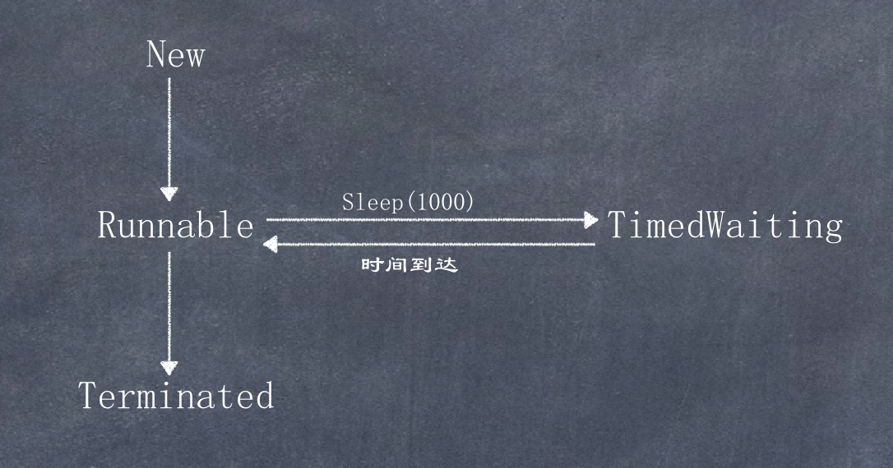

# TimedWaiting

Timed Waiting在API中的描述为这样一种状态: 一个正在限时等待另一个线程执行唤醒动作的线程所处的状态即Timed Waiting状态  

sleep方法会让当前线程进入到"休眠状态", 其实就是所谓的Timed Waiting(计时等
待)  

**实现一个计数器，计数到100，在每个数字之间暂停1秒，每隔10个数字输出一个字符串**  

```java
public class MyThread extends Thread {
    @Override
    public void run() {
        for (int i = 0; i < 100; i++) {
            if (i % 10 == 0) {
                System.out.println("============> " + i);
            }
            System.out.println(i);
            try {
                Thread.sleep(1000); // 1000millis, 即1秒
            } catch (InterruptedException ex) {
                ex.printStackTrace();
            }
        }
    }

    public static void main(String[] args) {
        new MyThread().start();
    }
}
```

