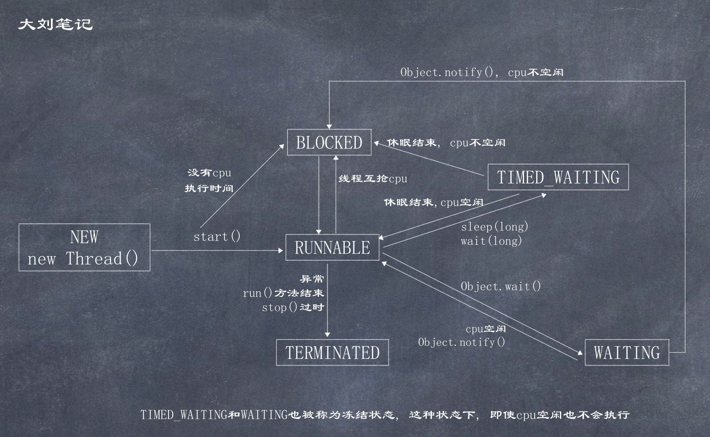

# 线程通知

  

wait和notify是成对出现的.   
- wait() 使线程进入WAITING状态, 在其他线程调用对象的notify()方法或notifyAll()方法之前, 此线程等待
- wait(long timeout) 使线程进入TIMED_WAITING状态, 在其他线程调用此线程对象的notify()方法或notifyAll()方法之前, 或者超过指定的时间量前, 此线程等待
- wait(long timeout, int nanos) 使线程进入TIMED_WAITING状态, 在其他线程调用此线程对象的notify()方法或notifyAll()方法之前, 或者超过指定的时间量前, 或者其他某个线程中断当前线程之前, 此线程等待  
- notify() 唤醒在此对象监视器上等待的单个线程
- notifyAll() 唤醒在此对象监视器上等待的所有线程  

```java
/**
 * 等待-唤醒示例
 * 消费者线程告知所要产品数量, 调用wait, 放弃cpu的执行
 * 生产者线程生产好后调用notify通知消费者
 *
 * 注意:
 *      这里的wait和notify方法, 只能由锁对象调用
 *      同步使用的锁对象必须保证唯一
 *      使用同步代码块让生产者或消费者只能有一个线程在运行
 *      notify会唤醒在此对象监视器上等待的单个线程, 会继续执行wait方法之后的代码
 */
public class DemoWaitAndNotify {
    public static void main(String[] args) {
        // 创建锁对象, 唯一
        Object object = new Object();

        // 消费者
        new Thread() {
            @Override
            public void run() {
                while (true) {
                    synchronized (object) {
                        System.out.println("消费者需要商品");
                        try {
                            object.wait();
                            // 因为父类的run()方法没有抛出异常,所以此处只能捕获,不能抛出异常
                        } catch (InterruptedException e) {
                            e.printStackTrace();
                        }
                        System.out.println("消费者拿到产品: 这里是被唤醒之后执行的代码");
                        System.out.println("=========================");
                    }
                }
            }
        }.start();

        // 生产者
        new Thread() {
            @Override
            public void run() {
                while (true) {
                    try {
                        // Thread.sleep(5000); // 同下
                        sleep(3000);
                    } catch (InterruptedException e) {
                        e.printStackTrace();
                    }

                    synchronized (object) {
                        System.out.println("生者者生产商品");
                        System.out.println("生产完毕, 通知消费者");
                        object.notify();
                    }
                }
            }
        }.start();
    }
}
```

**notifyAll()示例**

```java
/**
 * 使用wait(long milli), 在wait的毫秒值结束后, 线程自动醒来进入到Runnable/Blocked状态
 */
public class DemoTimeWaitingAndNotify {
    public static void main(String[] args) {
        Object object = new Object();

        // 消费者1
        new Thread() {
            @Override
            public void run() {
                while (true) {
                    synchronized (object) {
                        System.out.println("消费者 1 需要商品");
                        try {
                            object.wait();
                            // 因为父类的run()方法没有抛出异常,所以此处只能捕获,不能抛出异常
                        } catch (InterruptedException e) {
                            e.printStackTrace();
                        }
                        System.out.println("消费者 1 拿到产品: 这里是被唤醒之后执行的代码");
                        System.out.println("1 end =========================");
                    }
                }
            }
        }.start();

        // 消费者2
        new Thread() {
            @Override
            public void run() {
                while (true) {
                    synchronized (object) {
                        System.out.println("消费者 2 需要商品");
                        try {
                            object.wait();
                            // 因为父类的run()方法没有抛出异常,所以此处只能捕获,不能抛出异常
                        } catch (InterruptedException e) {
                            e.printStackTrace();
                        }
                        System.out.println("消费者 2 拿到产品: 这里是被唤醒之后执行的代码");
                        System.out.println("2 end =========================");
                    }
                }
            }
        }.start();

        // 生产者
        new Thread() {
            @Override
            public void run() {
                while (true) {
                    try {
                        // Thread.sleep(5000); // 同下
                        sleep(3000);
                    } catch (InterruptedException e) {
                        e.printStackTrace();
                    }

                    synchronized (object) {
                        System.out.println("生者者生产商品");
                        System.out.println("生产完毕, 通知消费者");
                        object.notifyAll();
                    }
                }
            }
        }.start();
    }
}
```

**调用wait和notify需要注意**

1. wait方法与notify方法必须要由同一个锁对象(即同步监视器对象)调用
2. wait方法与notify方法必须要在同步代码块或者是同步函数中使用, 因为必须要通过锁对象调用这2个方法