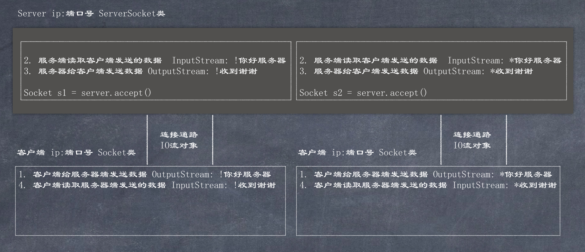

# 网络编程

Java中提供了两个Socket类用于实现TCP通信程序, Socket被称为套接字, 是两台机器间通信的端点  
1. 客户端 `java.net.Socket` 创建Socket对象, 向服务器发出连接请求, 服务器响应后建立连接开始通信  
2. 服务端 `java.net.ServerSocket` 创建ServerSocket对象, 相当于开启一个服务, 等待客户端的连接  

服务器启动 > 客户端和服务器建立一个逻辑连接, 这个连接可以使用一个IO字节流对象表示, 使用这个IO字节流对象进行通信.  

1. 多个客户端可以同时和服务器进行交互, 服务器端使用accept方法获取到请求的客户端对象 
2. 多个客户端同时和服务器进行交互, 需要使用多个IO流对象. 服务器端使用每个客户端Socket中提供的IO流进行交互, 服务器使用客户端的字节输入流读取客户端发送的数据, 使用客户端的字节输出流给客户端回写数据, 即, 服务器使用客户端的流和客户端进行交互.  

