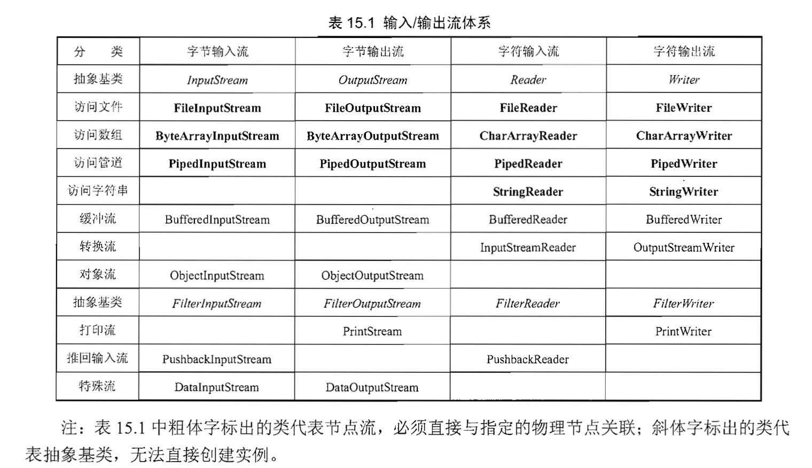
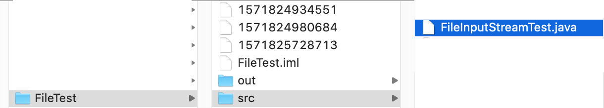
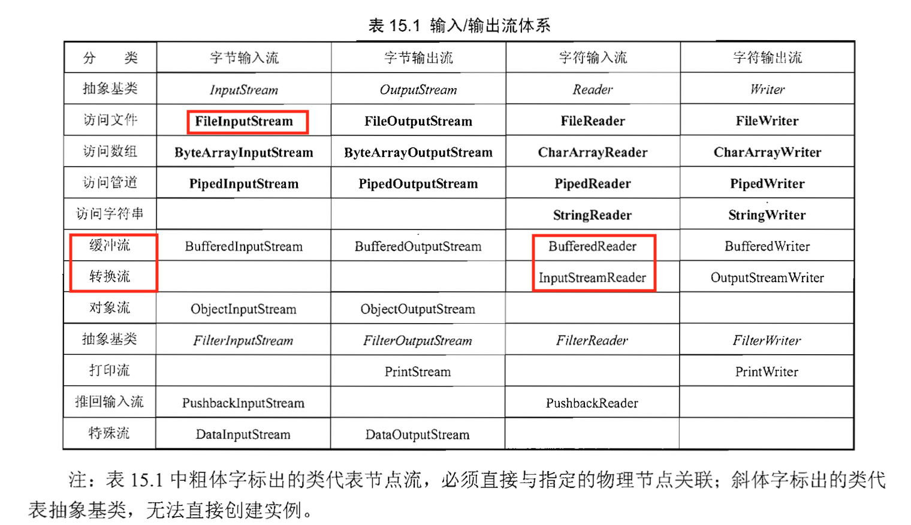

# 输入输出

Java的IO(输入输出)相关的类在java.io包下， Java 7在java.nio包下提供了一些新的API， 被称为NIO2

流分类：  
- 输入流
- 输出流

流类型分类：  
- 字节流：操作的数据单元是8位bit的字节 InputStream/OutpuStream
- 字符流：操作的数据单元是16位的字符 Reader/Writer

装饰器封装分类：  
- 底层节点流
- 上层处理流

### File

File有大量的操作方法，简单示例：

```java
import java.io.File;
import java.io.IOException;

public class FileTest {
    public static void main(String[] args) throws IOException {
        File file = new File("."); // 以当前路径创建一个File对象, 注意这是相对路径
        System.out.println(file.getName()); // .
        System.out.println(file.getParent()); // null 获取相对路径的父路径可能出错，输出null
        file = file.getAbsoluteFile(); // 获取绝对路径
        System.out.println(file); // /Users/liuweizhen/IdeaProjects/FileTest/.
        System.out.println(file.getParent()); // /Users/liuweizhen/IdeaProjects/FileTest
        File tmpFile = File.createTempFile("aaa", "txt", file); // 在当前路径下创建一个临时文件
        tmpFile.deleteOnExit(); // JVM退出时删除该文件
        File newFile = new File(System.currentTimeMillis() + ""); // 以系统当前时间作为新文件名来创建新文件(当前目录，即项目根目录)
        System.out.println("newFile对象是否存在：" + newFile.exists());
        newFile.createNewFile(); // 以newFile对象来创建一个文件
        // 以newFile对象创建一个目录,
        if (newFile.mkdir()) {
            System.out.print("创建目录成功：" + newFile.getAbsolutePath());
        } else {
            System.out.print("创建目录失败：" + newFile.getAbsolutePath());
        }
        String[] fileList = file.list();
        System.out.println("======== 当前路径下所有文件和路径 ========");
        for (String fileName : fileList) {
            System.out.println(fileName);
        }
        // 获取磁盘根路径
        File[] roots = File.listRoots();
        System.out.println("==== 系统所有根路径如下 =====");
        for (File root : roots) {
            System.out.println(root);
        }
    }
}
```

### 文件过滤器

FilenameFilter是一个接口，File类的list()方法中可以接收一个FilenameFilter参数，通过该参数可以只列出符合条件的文件。

```java
@FunctionalInterface
public interface FilenameFilter {
    boolean accept(File dir, String name);
}
```

```java
import java.io.File;

public class FilenameFilterTest {
    public static void main(String[] args) {
        File file = new File(".");
        // 如果文件名以.java结尾或者文件对应一个路径，则返回true
        String[] nameList = file.list((dir, name) -> {
           return name.endsWith(".java") || new File(name).isDirectory();
        });
        for (String name : nameList) {
            System.out.println(name);
        }
    }
}
```


### Java的流体系



此外，还有一业处理具体业务场景的流，比如:   

```java
AudioInputStream
CipherInputStream
DeflaterInputStream
ZipInputStream 
```

**节点流 FileInputStream示例**

```java
import java.io.FileInputStream;

public class FileInputStreamTest {
    public static void main(String[] args) {
        try (
                // 创建字节输入流
                FileInputStream inputStream = new FileInputStream("/Users/daliu-macbook/IdeaProjects/FileTest/src/FileInputStreamTest.java");
                ) {
            byte[] buffer = new byte[1024];
            int hasRead = 0;
            while ((hasRead = inputStream.read(buffer)) > 0) {
                System.out.print(new String(buffer, 0, hasRead));
            }
        } catch (Exception ex) {

        }
    }
}
```

**注：**上面新建FileInputStream对象时使用了绝对路径, 这是因为在IDEA中我把FileInputStreamTest放在了src中：



如果新建FileInputStream指定：`new FileInputStream("FileInputStreamTest.java")`，直接使用IDEA运行，它会在项目的根目录IdeaProjects/FileTest/下找`FileInputStreamTest.java`文件，但这样是找不到的。  
当然，如果不希望写上全路径，也可以使用`new FileInputStream("FileInputStreamTest.java")`，但这就需要手动进入`IdeaProjects/FileTest/`目录下使用命令`javac FileInputStreamTest.java`，这样就会在`FileTest/src/`下生成`FileInputStreamTest.class`文件，再调用`java FileInputStream`运行即可。

另外，上面的程序有一个潜在的问题，就是读取字符是从缓冲区`byte[] buffer = new byte[1024]`中读取的，然后通过这个缓冲区转换成String, 那么假设有一个汉字是一个byte所示不了的而恰恰在最后一个byte分开，即byte[1023]的位置存储了这个汉字所要表示的一部分，那么转换成String就可以出现乱码。针对这种现象，可以不使用这种底层的字节输入流，而使用上层的包装缓冲流`BufferedReader`读取，`BufferedReader`提供了`readLine`方法，可以一行一行的读取文本，不过由于`BufferedReader`是上层的包装流，因为需要中间的转换流`InputStreamReader`负责转换一下：



代码如下：

```java
import java.io.*;

public class BufferedReaderTest {
    public static void main(String[] args) {
        try (
                FileInputStream inputStream = new FileInputStream("/Users/daliu-macbook/IdeaProjects/FileTest/src/BufferedReaderTest.java");
                InputStreamReader reader = new InputStreamReader(inputStream);
                BufferedReader bufferedReader = new BufferedReader(reader);
        ) {
            String line = null;
            while ((line = bufferedReader.readLine()) != null) {
                System.out.println(line);
            }
        } catch (IOException ex) {

        }
    }
}
```

除此之外，InputStream和Reader还支持如下方法移动记录指针：

- void mark(int readAheadLimit): 在记录指针当前位置记录一个标记(mark)
- boolean markSupported(): 判断此输入流是否支持mark()操作，即是否支持标记
- void reset(): 将此流的记录指针重新定位到上一次记录标记(mark)的位置
- long skip(long n): 记录指针向前移动n个字节/字符

### OutputStream 和 Writer

OutPutStream示例，把当前java文件复制内容放入newFile.txt中：   

```java
import java.io.File;
import java.io.FileInputStream;
import java.io.FileOutputStream;
import java.io.IOException;

public class FileOutputStreamDemo {
    public static void main(String[] args) {
        FileInputStream inputStream = null;
        FileOutputStream outputStream = null;
        String srcPath = "/Users/daliu-macbook/IdeaProjects/FileTest/src/FileOutputStreamDemo.java";
        try {
            inputStream = new FileInputStream(srcPath);
            outputStream = new FileOutputStream("newFile.txt");
            byte[] buffer = new byte[32];
            int hasRead = 0;
            // 循环从输入流中取出数据
            // -1表示读取结束
            while ((hasRead = inputStream.read(buffer)) > 0) {
                // 每次读取一次，即写入方件输出流，读了多少就写多少
                outputStream.write(buffer, 0, hasRead);
            }
        } catch (IOException ex) {
            ex.printStackTrace();
        } finally {
            if (inputStream != null) {
                try {
                    inputStream.close();
                    outputStream.close();
                } catch (Exception ex) {
                    ex.printStackTrace();
                }
            }
        }
    }
}
```

### 重定向输入/输出

```java
System.setErr(PrintStream err);
System.setIn(InputStream in);
System.setOut(PrintStream out);
```

重定向标准输出流示例：

```java
import java.io.FileOutputStream;
import java.io.IOException;
import java.io.PrintStream;

public class RedirectOut {
    public static void main(String[] args) {
        PrintStream ps = null;
        try {
            ps = new PrintStream(new FileOutputStream("out.txt"));
            // 重定向标准输出流
            System.setOut(ps);
            System.out.println("普通字符串");
            System.out.println(new RedirectOut());
        } catch (IOException ex) {
            ex.printStackTrace();
        } finally {
            if (ps != null) {
                ps.close();
            }
        }
    }
}
```

查看out.txt:   
普通字符串   
RedirectOut@2503dbd3  

重定向标准输入流示例：

```java
import java.io.File;
import java.io.FileInputStream;
import java.io.IOException;
import java.util.Scanner;

public class RedirectIn {
    public static void main(String[] args) {
        String currentPath = new File("").getAbsolutePath() + "/src/RedirectIn.java";
        System.out.println(currentPath);
        try (
                FileInputStream inputStream = new FileInputStream(currentPath);
                ) {
            System.setIn(inputStream);
            Scanner scanner = new Scanner(System.in);
            scanner.useDelimiter("\n");
            while (scanner.hasNext()) {
                System.out.println(scanner.next());
            }
        } catch (IOException ex) {
            ex.printStackTrace();
        }
    }
}
```

### 转换流

InputStreamReader和OutputStreamReader是Java io中两个重要的转换流,这两个流负责把字节流转换为字符流.其中InputStreamReader将字节输入流转换成字符输入流, OutputStream负责把字节输入出流转换为字符输出流.   
键盘输入System.in是InputStream字节输入流, 下面我们把InputSreamReader通过转换流转换成InputStreamReader, 然后再把InputStreamReader包装到BufferedReader中,从而可以方便的使用BufferedReader中的readLine()方法:


```java
import java.io.BufferedReader;
import java.io.IOException;
import java.io.InputStream;
import java.io.InputStreamReader;

public class KeyInTest {
    public static void main(String[] args) {
        try (
                // 将System.in字节输入流转换成字符输入流InputStreamReader
                InputStreamReader inputStreamReader = new InputStreamReader(System.in);
                // 将字符输入流InputStreamReader转换成BufferedReader
                BufferedReader reader = new BufferedReader(inputStreamReader);
                ) {
                String line = null;
                while ((line = reader.readLine()) != null) {
                    if (line.equalsIgnoreCase("exit")) {
                        System.out.println("Bye!");
                        System.exit(1);
                    }
                    System.out.println("输入的内容是: " + line);
                }
        } catch (IOException ex) {
            ex.printStackTrace();
        }
    }
}
```

### 推回输入流

在输入输出流体系中, 有两个特殊的流, PushBackInputStream和PushBackReader;
推回输入流有一个推回缓冲区, 当调用unread方法时, 系统会把指定内容推回到缓冲区里, 当使用read读取流中的东西时,会先从推回缓冲区中读取. 

下面程序试图找出"new PushbackReader"字符串, 当找到该字符串后,程序只是打印出目标字符串之前的内容.

```java
import java.io.File;
import java.io.FileReader;
import java.io.IOException;
import java.io.PushbackReader;

public class PushbackTest {
    public static void main(String[] args) {
        String currentPath = new File("").getAbsolutePath() + "/src/PushbackTest.java";
        String targetStr = "new PushbackReader";
        int length = targetStr.length();
        try (
                // 新建推回输入流, length是缓冲区长度
                PushbackReader pr = new PushbackReader(new FileReader(currentPath), length*2);
                ) {
            char[] buffer = new char[length];
            String lastContent = "";
            int hasRead = 0;
            while ((hasRead = pr.read(buffer)) > 0) {
                String content = new String(buffer, 0, hasRead);
                int targetIndex = 0;
                // 如果包含目标字符串
                if ((targetIndex = (lastContent + content).indexOf(targetStr)) > 0) {
                    // 把本次内容和上次内容一起推回缓冲区
                    pr.unread((lastContent + content).toCharArray());
                    // 重新定义一个长度为targetIndex的char数组
                    if (targetIndex > length) {
                        buffer = new char[targetIndex];
                    }
                    // 再次读取指定长度的内容(目标字符串之前的内容)
                    pr.read(buffer, 0, targetIndex);
                    System.out.println(new String(buffer, 0, targetIndex));
                    System.exit(0);

                } else {
                    System.out.print(lastContent);
                    lastContent = content;
                }
            }
        } catch (IOException ex) {
            ex.printStackTrace();
        }
    }
}
```

### RandomAccessFile

使用RandomeAccessFile可以跳转到文件的任意位置读写数据. 不过它只能读写文件, 不可读取其他IO数据. RandomAccessFile有4个模式:

- r: 只读
- rw: 读写, 如果文件不存在, 则试图创建该文件
- rws: 相对于rw模式, 还要求对文件的内容或元数据的每个更新都同步写入到底层存储设备
- rwd: 相对于rw模式, 还要求对文件内容的每个更新都同步写入到底层存储设备

```java
import java.io.File;
import java.io.IOException;
import java.io.RandomAccessFile;

public class RandomAccessFileTest {
    public static void main(String[] args) {
        String path = new File("").getAbsolutePath() + "/src/RandomAccessFileTest.java";
        try (
                RandomAccessFile accessFile = new RandomAccessFile(path, "r");
                ) {
            long pointer = accessFile.getFilePointer();
            System.out.println(pointer); // 1
            accessFile.seek(2);
            byte[] buffer = new byte[1024];
            int hasRead = 0;
            hasRead = accessFile.read(buffer);
            String str = new String(buffer, 0, hasRead);
            if (str.contains("public class")) {
                int index = str.indexOf("public class");
                accessFile.seek(index); // 读取public class之后的内容, 包括public class
            }
            while ((hasRead = accessFile.read(buffer)) > 0) {
                System.out.println(new String(buffer, 0, hasRead));
            }
        } catch (IOException ex) {
            ex.printStackTrace();
        }
    }
}
```

使用RandomAccessFile追加内容:

```java
import java.io.File;
import java.io.IOException;
import java.io.RandomAccessFile;

public class RandomAccessFileTest {
    public static void main(String[] args) {
        String path = new File("").getAbsolutePath() + "/src/RandomAccessFileTest.java";
        try (
                RandomAccessFile accessFile = new RandomAccessFile(path, "rw")
        ) {
            accessFile.seek(accessFile.length());
            accessFile.write("这是追加的内容".getBytes());
        } catch (IOException ex) {
            ex.printStackTrace();
        }
    }
}
```

**注**: RandomAccessFile依然不能向文件的指定位置插入内容, 如果直接将文件记录指针移到中间某位置后开始输出, 则新输出的内容会覆盖文件中原有的内容. 如果需要向指定的位置插入内容,程序需要先把插入点后面的内容读入缓冲区:

```java
import java.io.*;

public class InsertContent {
    public static void insert(String fileName, long pos, String insertContent) throws IOException {
        File tmpFile = File.createTempFile("tmp", null);
        tmpFile.deleteOnExit();
        try (
                RandomAccessFile accessFile = new RandomAccessFile(fileName, "rw");
                // 使用临时文件保存插入点之后的内容
                FileOutputStream outStream = new FileOutputStream(tmpFile);
                FileInputStream inStream = new FileInputStream(tmpFile);
                ) {
            // 读取插到点之后的内容到临时文件中
            accessFile.seek(pos);
            byte[] buffer = new byte[128];
            int hasRead = 0;
            while ((hasRead = accessFile.read(buffer)) > 0) {
                outStream.write(buffer, 0, hasRead);
            }
            // 重新定位到插入点, 把要插入的数据插入
            accessFile.seek(pos);
            accessFile.write(insertContent.getBytes());
            // 再把保存临时文件中的内容添加进去
            while ((hasRead = inStream.read(buffer)) > 0) {
                accessFile.write(buffer, 0, hasRead);
            }
        }
    }

    public static void main(String[] args) throws IOException {
        String path = new File("").getAbsolutePath() + "/src/InsertContent.java";
        insert(path, 16, "这是插入的内容");
    }
}
```

一般下载工具在下载文件时都会建立两个文件: 一个是与被下载文件大小相同的空文件, 一个是记录文件指针的位置文件, 下载工具用多条线程启动输入流来读取网络数据, 并使用RandomeAccessFile将从网络上读取的数据写入前面建立的空文件中, 每写一些数据后, 记录文件指针的文件就分别记下每个RandomeAccessFile当前文件指针位置----网络断开后, 再次开始下载, 每个RandomeAccessFile都根据记录文件指针的文件中记录的位置继续向下写数据.
