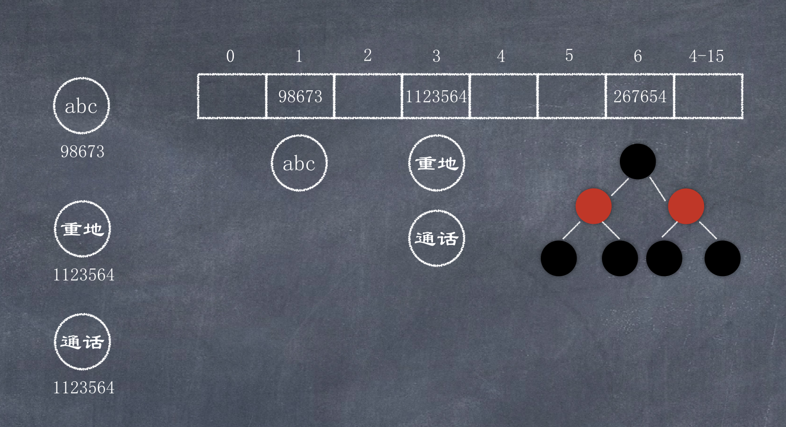

# HashSet

### 哈希值

哈希值是一个十进制的整数, 由系统随机给出, 默认是对象的地址值, 是一个逻辑地址, 不是实际存储的物理地址.  
位于java.lang包下的Object对象就有hashCode()方法  

```java
public native int hashCode();
Returns a hash code value for the object. This method is supported for the benefit of hash tables such as those provided by HashMap.
```

`toString`方法的源码就使用了hashCode: 

```java
return getClass().getName() + "@" + Integer.toHexString(hashCode());
```

String类重写了Object的hashCode()方法, 源码如下:  

```java
public int hashCode() {
    int h = hash;
    if (h == 0 && value.length > 0) {
        char val[] = value;

        for (int i = 0; i < value.length; i++) {
            h = 31 * h + val[i];
        }
        hash = h;
    }
    return h;
}
```

```java
public class VectorDemo {
    public static void main(String[] args) {
        String s1 = new String("abc");
        String s2 = new String("abc");

        System.out.println(s1.hashCode() == s2.hashCode()); // true
        System.out.println("重地".hashCode() == "通话".hashCode()); // true;
    }
}
```


### 哈希表

JDK1.8之前, 哈希表底层采用数组+链表实现, 即使用链表处理冲突, 同一hash值的对象都存储在一个链表里. 但是当位于一个桶中的元素较多, 即hash值相等的元素较多时, 通过key值依次查找的效率较低. 而JDK1.8中, 哈希表存储采用数组+链表+红黑树实现, 当链表长度超过阀值(8)时, 将链表转换为红黑树, 这样大大减少了查找时间.  
简单来说, 哈希表是由数组+链表+红黑树实现的.  

通过HashCode查找数组中的元素, 通过equals方法决定是否存储.  
之所以存在链表/红黑树, 是因为可能存在两个对象不相同, 但hashCode相同, 这被称为哈希值冲突. 
系统在构建哈希表时, 默认会先开16个长度的数组, 当遇到某一个哈希冲突超过8时, 就会把链接转换为红黑树, 这样查询起来速度变快.  

原理如图:  



Set中不允许存储重复元素, set集合add元素时, 会先调用该元素的hashCode方法计算出它的哈希值, 然后在集合中找有没有相同哈希值的元素, 如果没有, 直接存储, 如果有相同的哈希值, 就出现了哈希冲突, 然后调用equals方法和哈希值相同的元素进行比较, 如果仍然相同, 则add失败, 不存储; 如果equals方法返回false, 则把该元素存储到链表/红黑树中. 