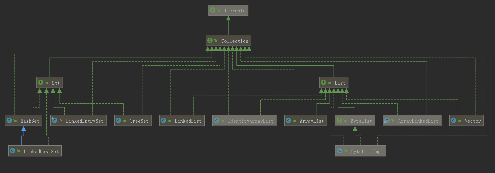

# 简介

Jata.util包下, Java的集合分为单列集合和双列集合, 单列集合即只每个元素是一个对象, 双列集合是基于key-value的集合. 双列集合顶层接口是Map, 单列集合顶层接口是Collection, 其中Collection又分为两大类: 基于Set接口和List接口都有很多集合类  



其中Collection下的子接口或实现类为: 

```java
All Known Implementing Classes:
AbstractCollection, AbstractList, AbstractQueue, AbstractSequentialList, AbstractSet, ArrayBlockingQueue, ArrayDeque, ArrayList, AttributeList, BeanContextServicesSupport, BeanContextSupport, ConcurrentHashMap.KeySetView, ConcurrentLinkedDeque, ConcurrentLinkedQueue, ConcurrentSkipListSet, CopyOnWriteArrayList, CopyOnWriteArraySet, DelayQueue, EnumSet, HashSet, JobStateReasons, LinkedBlockingDeque, LinkedBlockingQueue, LinkedHashSet, LinkedList, LinkedTransferQueue, PriorityBlockingQueue, PriorityQueue, RoleList, RoleUnresolvedList, Stack, SynchronousQueue, TreeSet, Vector
```

Vector是SDK1.1出现的, Vector是线程安全, 即同步的, 效率相对较低, 因此JDK1.2后使用List代替, List下面的实现类有: 

```
AbstractList, AbstractSequentialList, ArrayList, AttributeList, CopyOnWriteArrayList, LinkedList, RoleList, RoleUnresolvedList, Stack, Vector
```

Set下面的实现类有: 
```java
AbstractSet, ConcurrentHashMap.KeySetView, ConcurrentSkipListSet, CopyOnWriteArraySet, EnumSet, HashSet, JobStateReasons, LinkedHashSet, TreeSet
```

双列集合Map接口的实现类:    
```java
AbstractMap, Attributes, AuthProvider, ConcurrentHashMap, ConcurrentSkipListMap, EnumMap, HashMap, Hashtable, IdentityHashMap, LinkedHashMap, PrinterStateReasons, Properties, Provider, RenderingHints, SimpleBindings, TabularDataSupport, TreeMap, UIDefaults, WeakHashMap
```